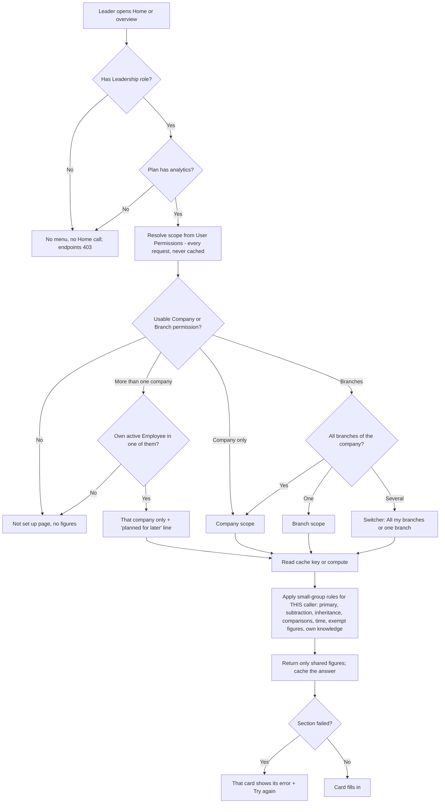

# 012 · Leadership view — functional spec

**I recommend. You decide.** No code was changed. No bench, docker or server command was run.

## The short answer

**Bad news first.**

1. **Three live leaks come first.** HR Analytics, `attendance_analytics.person()` and
   `set_org_setting` each let someone see or unlock data outside their branch or role
   today (01c G1–G3). They are fixed in **push 1**, before any leader screen.
2. **Six small gaps in the approved design need a ruling or a line of copy** before the
   engineer can finish every criterion. None blocks the first day of work. The biggest:
   - **D18 rule 2 can never clear for a company that truly had no leavers.** HR has no
     "the figure is right" button for leavers, so that company shows "Needs review"
     forever (BA-Q1).
   - **Employees with no branch are a hidden group nobody designed.** Company total minus
     every branch row gives their figures by subtraction (BA-Q2).
   - **The amber chip says "HR has been told", but nothing tells HR.** The slice sends no
     notification (BA-Q11).
3. **A central HR Manager with no Employee record and no Company permission will see an
   empty HR Analytics after the G1 fix.** That is the fail-closed rule security chose. It
   needs a message and your agreement (BA-Q5).

**What the slice is:** one epic, **28 user stories, 110 points** (105 committed, plus
5 for the droppable D15 story), **163 acceptance criteria**, in **two pushes to dev**:

| Push | What | Stories | Points |
|---|---|---|---|
| 1 | Indexes, then Step 0: one shared calculation, doubtful days, "Needs review", Data to review page, HR Analytics scoped (G1), `person()` scoped (G3), `set_org_setting` allow-list and org-roles guard (G2) | US-1 to US-10 | 38 |
| 2 | Leader view: role and scope, Home card, overviews, small-group rules, switcher, settings, employee line | US-11 to US-27 | 67 |
| 2, droppable | Departments across all branches (D15) — only if the two-way rule is small and proven | US-28 | 5 |

**Gap analysis verdict in one line:** mostly **extend** our own `alvoraa_portal` app on top
of standard Frappe HR records; **configure** the role, User Permissions, user defaults
and indexes; **build new** only two small doctypes (leader settings, data review items);
**drop** nothing from the approved brief, but **do not reuse** `get_hr_analytics`,
`_analyse`, or the org-roles setting for leaders.

**Security open questions use the stated defaults, each marked ⚠ pending your
confirmation:** Q1 (own record and people seen in My team do not count), Q2 (D15 only if
proven), Q3 (decide once per group), Q4/Q5 (G2 and G3 in Step 0), Q6 (block Leadership
and employee-level roles in code), Q7–Q12 (security engineer's defaults).

**I am not a lawyer.** Every legal point below is flagged for counsel or the compliance
owner, not settled.

---

## 0 · Cross-module reach and personas

| App | Touched? | How |
|---|---|---|
| `alvoraa_portal` | **Yes, most of the work** | `hr_api.py` (`get_hr_analytics`, `set_org_setting`, `get_org_setting`), `attendance_analytics.py` (`person`, `filter_options`, `_org_roles`), new leader module and endpoints, two new doctypes, `hooks.py` (cron, `after_migrate`), `www/hrms-employee.html` (menu, Home card, overview, settings tab, Data to review, employee line) |
| `hrms` (our code under `hrms/hrms/alvoraa_hr_core`) | Read and reused, not changed | `access.log_refusal`, `access.permitted_companies`. `attendance_score.py` must **not** change (see US-2 AC-11) |
| `hrms` (Frappe HR upstream) | **Read only. Never edited** | Attendance, Employee Checkin, Leave Application, Leave Allocation, Leave Period, HR Settings, `utils/holiday_list.get_holiday_list_for_employee` |
| `erpnext` | Read only | Employee, Branch, Department, Company, Fiscal Year (`get_fiscal_year` via `_leave_year_start`) |
| `frappe` | Configure | Role, User Permission, user defaults, `Version` (change history), `track_changes`, `frappe.db.add_index`, scheduler, cache |
| `alvoraa_goals` | **Must not read the leader module** | PRIV-13. An import check guards it |
| `alvox_compensation` | Not touched | Pay is out of scope |

**HRMS domains:** attendance (figures, doubtful days, Today counts), leaves (leave used,
on leave today, requests waiting), org structure (company, branch, department,
reporting line for PRIV-9), people records (headcount, joiners, leavers). **Payroll,
appraisals, goals, compensation and learning are not touched.** Appraisal attendance
scores (`attendance_score.py`) keep their own formula on purpose: a leader-view change
must never move a rating.

**Personas used in this spec** (names come from the prototype's sample tenant, Kavya Retail):

| Persona | Who in the prototype | Access set-up |
|---|---|---|
| **Company head** (CXO persona) | Meera Nair, MD, Kavya Retail | Leadership + Company permission |
| **Branch head** | Arjun Mehta, Lakeside Mall (64 people) | Leadership + Branch permission |
| **Head of a tiny branch** | Farah Khan, Hilltop Kiosk (4) | Leadership + Branch permission |
| **Area manager** (several branches) | Neha Iyer (Old Market 71 + Riverside 49); Dev Malhotra (Hilltop Kiosk 4 + Station Road 42) | Leadership + 2 Branch permissions |
| **Owner of a two-branch company** | Kabir Sethi, Meadow Foods (Airport Kiosk 4, Main Store 61) | Leadership + Company permission |
| **Leader not set up** | Rohan Das | Leadership only |
| **System Manager** | Vikram Shah | System Manager |
| **HR Manager (central)** | Priya Raman | HR Manager |
| **Store HR** (location HR, template T3) | "Lakeside store HR" | HR User + Branch permission |
| **Employee / frontline employee** | Sunil Kumar, Lakeside Mall | Employee |
| **Line manager** | A manager with 60 of Lakeside's 64 below them | Employee (+ approver roles) |

Kavya Retail branches (sample): Head Office, Gurugram 58 · Hilltop Kiosk 4 · Lakeside
Mall 64 · Old Market 71 · Riverside 49 · Station Road 42. Company 288. Lakeside
departments: Sales floor 39 · Cashiers 12 · Security 4 · Stock room 9.

---

## 1 · Gap analysis

Every "today" column below quotes what I read in the source on 15 Sep 2026. Where I
could not read the source (ERPNext and parts of Frappe are not in this repo), the row
says `[UNVERIFIED — engineer to confirm]`.

### 1a · Step 0 (push 1)

| # | Requirement | Standard behaviour today (what I read) | Verdict | Cost |
|---|---|---|---|---|
| G-1 | One attendance % for HR Analytics and leaders (LV3) | `hr_api.get_hr_analytics` (`hr_api.py:430-439`): (Present + ½ Half Day) ÷ (that + Absent); ignores Work From Home and On Leave. `attendance_analytics._analyse` (`:240-270`, `:330`): Present + WFH ÷ expected days, where Half Day and **On Leave count as expected**. Frappe HR ships no org attendance %. Attendance `status` options: Present, Absent, On Leave, Half Day, Work From Home (`attendance.json`) | **Extend** — one shared calculation in `alvoraa_portal`, SQL `GROUP BY`, used by HR Analytics and the leader view | M |
| G-2 | Leave used for **this leave year** (LV2) | `hr_api.py:442-449` sums `total_leaves_allocated` of **every** submitted allocation ever. `_leave_year_start()` (`hr_api.py:56-81`) already resolves the leave year from ERPNext Fiscal Year, falling back to calendar year. Leave Allocation has `from_date`, `to_date`, `company`, `leave_period` | **Extend** — reuse `_leave_year_start`, count allocations overlapping the year | S |
| G-3 | Late arrivals, short days | Attendance has `late_entry`, `early_exit`, `working_hours`, `shift` (`attendance.json`). Short-day rule and tolerance live in `attendance_analytics.py:249-259`, tolerance in Defaults key `alvoraa_attendance_short_tolerance_mins` (default 30) | **Extend** — same rule, counted in SQL | S |
| G-4 | Doubtful days (D5, D5b) found, stored, left out, confirmed | Nothing in Frappe HR. No data-quality record exists | **Build new** — one small doctype `Alvoraa Data Review Item`. *Why not ToDo or Comment:* neither carries `company` and `alvoraa_branch`, so User Permissions would not scope them (SEC-13) | M |
| G-5 | "Needs review" for leave (D6) and leavers (D18) | Nothing. Employee `status`, `relieving_date` exist `[UNVERIFIED in ERPNext source — used by our code in attendance_score.py:115]` | **Extend** (rules) + same doctype as G-4 | S |
| G-6 | Morning checks job | `hooks.py:175` has `scheduler_events`. Frappe `cron` runs on `default` queue (07 §3 D) | **Configure + Extend** — cron entry that enqueues on `long` | S |
| G-7 | HR "Data to review" page | Nothing | **Extend** — portal panel + 2 endpoints | M |
| G-8 | HR Analytics scoped to company/branch (G1) | `hr_api.py:376-520`: raw SQL with no company or branch filter; `confirmations_due` and `recent_employees` use `get_all(..., ignore_permissions=True)`. `access.permitted_companies()` (`alvoraa_hr_core/access.py:102-124`) already resolves HR companies and fails closed | **Extend** — add scope to every query; `get_list` for the two name lists | M |
| G-9 | `person()` and `filter_options()` scoped (G3) | `attendance_analytics.py:473-475` allows anyone in org roles to open **any** employee; `filter_options` uses `get_all` (`:444-452`). `summary(view="organisation")` already scopes with `get_list` (`:157`) | **Extend** — reuse `_population("organisation")` check; cap date range | S |
| G-10 | `set_org_setting` allow-list (G2) and org-roles guard (SEC-19) | `hr_api.py:2211-2222` reads and writes **any** Defaults key for HR Manager or System Manager, no record. `_org_roles()` (`attendance_analytics.py:55-57`) trusts the stored list | **Extend** — allow-list in code; ignore Leadership and employee-level roles | S |
| G-11 | Indexes (OPS-52) | Attendance indexes: `employee`, `status`, `attendance_date` (`attendance.json`). Employee Checkin: `employee`, `shift` (+ `alvoraa_branch` from slice 011). Employee: `status`, `designation`, `attendance_device_id`, `lft`, `rgt` (DevOps measured, 07 §1) | **Configure** — `frappe.db.add_index` in `after_migrate`, the pattern `attendance_deduction.py:212` already uses | S |

### 1b · Leader view (push 2)

| # | Requirement | Standard behaviour today (what I read) | Verdict | Cost |
|---|---|---|---|---|
| L-1 | A leader persona | No role. `alvoraa_policy_library/access.py:50` treats "Alvoraa CXO" as "sees all" on policies, so that name must not be reused | **Configure** — new Role "Leadership", created on migrate, no document permissions | S |
| L-2 | Scope = company or branches | Frappe User Permission: `user`, `allow`, `for_value`, `apply_to_all_doctypes`, `applicable_for`, `hide_descendants`; only System Manager has DocPerm; `track_changes` on (read in Frappe 16.22 source from another local project, **same major version, not proven same build**) | **Configure** (User Permission) + **Extend** (one scope resolver, SEC-1) | M |
| L-3 | Branch belongs to a company | ERPNext Branch: `[UNVERIFIED — 01c V6; recalled as having no company link]` | **Extend** — resolver ties branch to company through the people in it (SEC-1, SEC-2) | — |
| L-4 | Totals by branch, department, trend, Today | Frappe HR number cards and "Employee Analytics" reports exist (brief §3) but have no scope-aware small-group hiding | **Extend** — leader endpoints (`leader_home`, `leader_summary`, `leader_trend`) | L |
| L-5 | Small-group rules (PRIV-2 to PRIV-9) | Nothing in Frappe. Our upward feedback hides below 3 responses (01a LV17) — an idea, not reusable code | **Extend** — one suppression function, property-tested | M |
| L-6 | Remember the last scope | Frappe user defaults (`frappe.defaults.set_user_default`) | **Configure** — key `alvoraa_leader_scope` (SEC-21) | S |
| L-7 | Minimum group setting, System Manager only, recorded | `HR Settings` is a Single with `track_changes: 1`, **but HR Manager has write** (`hr_settings.json` permissions). Slice 010 put its review settings on HR Settings because HR Manager may change them. Frappe Defaults (`set_org_setting`) keep no history | **Build new** — Single doctype `Alvoraa Leader View Settings`, `track_changes` on, System Manager write, HR Manager read. *Why not HR Settings:* making one field System-Manager-only needs Custom DocPerm rows, and once any Custom DocPerm exists for a doctype Frappe stops reading its standard permissions `[UNVERIFIED on our build — engineer to confirm]`; a small doctype we own avoids touching HR Settings' permissions at all. **Engineer may argue for HR Settings at strategy (BA-Q10)** | S |
| L-8 | Change history | Frappe `Version`: System Manager read/report/export; only Administrator delete (`version.json`) | **Configure** — `track_changes` + one filtered endpoint for HR Manager (SEC-11) | S |
| L-9 | Cache | Frappe cache prefixes site name (07 §1) | **Extend** — keys per 07 §3 C | M |
| L-10 | Employee "who can see" line | Nothing | **Extend** — built from real permissions (PRIV-12) | S |
| L-11 | Today "expected" people | `hrms.utils.holiday_list.get_holiday_list_for_employee` and `hrms.hr.utils.get_holidays_for_employee` exist | **Configure (reuse)** — expected = active, joined, not on approved leave today, not on holiday per their holiday list | S |

### 1c · What I recommend dropping or not reusing

| Item | Verdict | Reason |
|---|---|---|
| Reusing `get_hr_analytics` for leaders | **Do not reuse** (OPS-1) | Unscoped, raw SQL; it gets rewritten in Step 0 for HR only |
| Reusing `attendance_analytics._analyse`, `goals_api.get_team_goals`, `hr_api._mark_actionable` to fetch | **Do not reuse the fetching** (OPS-6) | Loads rows per person. The arithmetic ideas are reused |
| Adding Leadership to `alvoraa_attendance_org_roles` | **Refused, and blocked in code** (SEC-19, Q6) | Shows names and leave types |
| OPS-8 nightly per-day summary | **Not in this slice** (OPS-51) | Cannot give distinct-people counts; only needed if the budget is breached |
| OPS-46 build lock per cache key | **Not adopted until you decide** | Consider-level |
| HR "Needs you" strip item on Home | **Depends on slice 009.** I found no "Needs you" strip in `hrms-employee.html` today. If it does not exist at build time, the HR Analytics line alone carries the link | Avoids building 009's frame inside 012 |
| Nothing from the approved brief | — | The brief is already thin |

**Single source of truth:** attendance figures = submitted `Attendance` records, with the
branch they were saved with (`alvoraa_branch`, slice 011). Leave = `Leave Application`
and `Leave Allocation`. People = `Employee`. The leader view and HR Analytics **store no
figures**; they compute from these. The only stored things are data-quality findings,
HR confirmations, one setting, and a remembered scope.

---

## 2 · Process flows

### 2a · Morning checks and HR review (push 1)

1. 06:30 site time, the cron entry queues "leader data checks" on the `long` queue.
2. For each company, each branch, the last 35 days: is a day doubtful? (≥ 95% of expected
   people absent **and** < 5% checked in; only groups with at least the minimum expected
   people; with no check-ins in the tenant, 95% absent alone.)
   - Yes, and no item yet → create an **Open** item.
   - Yes, item already **Confirmed** → leave it alone.
   - No, item Open → mark **Cleared** (never delete).
3. Leave rule D6 and leavers rule D18 run the same way per company (and D18 rule 1 per branch).
4. Job writes "last successful run". A failure logs "Leader data checks failed" and the
   stamp stays old.
5. Priya opens **Data to review** → the page re-runs D6 and D18 for her scope, then lists items.
   - **Doubtful day:** she opens attendance for those days. **Decision:** fix the data
     (item clears next morning) **or** "The absence was real" → confirm dialog → Count them /
     Keep them left out.
   - **Leave used:** she opens leave requests. **Decision:** enter missing leave (item
     clears) **or** "The figure is right, show it" → confirm → Show it / Keep "Needs review".
   - **Leavers:** she opens the 14 people and adds leaving dates. No "it is right" button
     (see BA-Q1 for rule 2).
6. Each confirmation stores who, when, before and after; that company's leader cache is cleared.

**Unhappy paths:** job fails → amber line on Data to review after 26 hours. Store HR tries
another store's item → 403 + log. Two HR users confirm at once → second refused, no change.
Brand-new tenant, no attendance → no items, cards say "No figures yet".

### 2b · Leader opens the view (push 2)

**Unhappy paths:** out-of-scope branch in the request → 403 + security log. Removed role or
permission → next call refused. Redis down → figures computed and returned, one log line.
Remembered branch no longer linked → All my branches. Data looks wrong → amber warning,
days left out. Leave or leavers need review → "Needs review" everywhere that figure appears.

### 2c · System Manager changes the minimum

1. Vikram opens Company › Org settings › Leader view privacy.
2. He moves the stepper (3–10). The impact line updates with no server call.
3. He types a reason. **Decision:** Save → confirm dialog (lowering or raising) → Change / Keep.
4. Server checks role, range, reason, change. Saves; `Version` row written; all leader cache keys deleted.
5. Next leader load uses the new minimum.

**Unhappy paths:** same value → error. No reason → error. HR Manager through REST → refused.
Stored value broken → leader code uses 10 and logs.

---

## 3 · Data model

### 3a · New Role

| Record | Field | Value | Why |
|---|---|---|---|
| Role | `role_name` | Leadership | P1. Not "Alvoraa CXO" |
| Role | `desk_access` | 0 `[UNVERIFIED field name on our build — engineer to confirm]` | Leaders use the portal only |
| DocPerm / Custom DocPerm | — | **none** | SEC-4 |

Created in `after_migrate` and `after_install`, safe to run twice. Held by nobody on migrate.

### 3b · New Single doctype `Alvoraa Leader View Settings` (module in `alvoraa_portal`)

`issingle: 1`, `track_changes: 1`. Permissions: System Manager read + write; HR Manager read; no other role.

| fieldname | label | fieldtype | mandatory | default | options / notes | Why no existing field |
|---|---|---|---|---|---|---|
| `min_group_size` | Hide groups smaller than | Int | Yes | 5 | Controller: 3–10; refuse save when unchanged | No such setting exists anywhere |
| `change_reason` | Why are you making this change? | Small Text | Yes when `min_group_size` changes | — | Description: "Required. Kept in the change history below. Do not name employees." Cleared by the controller **after** the `Version` row is written, so an old reason is never re-recorded | History needs the why (D8) |
| `last_checks_run_on` | Last checked | Datetime | No | — | Read only. Written with `frappe.db.set_single_value` so it adds **no** `Version` row `[engineer to confirm]` | OPS-50 stamp |

Rules live in the **controller** (`validate`), so portal, desk, REST and data import obey them (SEC-10).

### 3c · New doctype `Alvoraa Data Review Item` (module in `alvoraa_portal`)

`track_changes: 1`. Not submittable. Naming: hash. Unique together: (`item_type`, `company`, `alvoraa_branch`, `check_date`) — enforced in `validate` and by a unique index added in `after_migrate`.

| fieldname | label | fieldtype | mandatory | default | options / depends_on | Why |
|---|---|---|---|---|---|---|
| `item_type` | What needs review | Select | Yes | — | Doubtful day / Leave used / Leavers | One doctype for all three (01b handoff) |
| `rule` | Rule | Data | No | — | e.g. `D5`, `D6`, `D18-1`, `D18-2` | Lets HR copy say which rule fired |
| `company` | Company | Link Company | Yes | — | — | User Permission on Company applies by itself |
| `alvoraa_branch` | Branch | Link Branch | No | — | Blank = company-wide item | User Permission on Branch applies by itself (as `branch_scope.py` does) |
| `check_date` | Day | Date | Doubtful day only | — | `depends_on: eval:doc.item_type=='Doubtful day'` | The day that looks wrong |
| `expected_count` | Expected at work | Int | No | 0 | Doubtful day | Counts only, never IDs (SEC-22) |
| `absent_count` | Marked absent | Int | No | 0 | Doubtful day | — |
| `checked_in_count` | Checked in | Int | No | 0 | Doubtful day | — |
| `affected_count` | Records affected | Int | No | 0 | Leave: requests entered; Leavers: people Left with no date | "14 people…" |
| `people_count` | People in scope | Int | No | 0 | Leave used | "for 288 people" |
| `days_allocated` | Days of leave allocated | Float | No | 0 | Leave used | "6,912 days" |
| `figure_without` | Figure without these days | Float | No | — | Doubtful day (attendance %), Leave used (%) | Shown in the confirm dialog |
| `figure_with` | Figure with these days | Float | No | — | Same | "about 71.4%" |
| `status` | Status | Select | Yes | Open | Open / Confirmed / Cleared | State table §4 |
| `confirmation` | Confirmation | Select | No | — | Absence was real / Figure is right. Read only after set | Which action HR took |
| `confirmed_by` | Confirmed by | Link User | No | — | Read only, set by server | SEC-13 |
| `confirmed_on` | Confirmed on | Datetime | No | — | Read only, set by server | SEC-13 |
| `first_found_on` | Found | Datetime | No | — | Read only | "Found 11 Sep, 06:00" |
| `last_checked_on` | Checked | Datetime | No | — | Read only | "Checked again every morning" |

**No employee field. No name field. No leave type.** Counts only.

Permissions: HR Manager read + write; HR User read + write; System Manager read. No create
or delete for any role in the desk (the job creates; nobody deletes). Controller refuses any
change to counts by a user, any change to `confirmation`, `confirmed_by`, `confirmed_on`,
`figure_*` after status is Confirmed, and a confirmation of a company-wide item by someone
whose scope does not cover the whole company (SEC-13).

### 3d · Standard records: no new fields

| Doctype | Change | Why nothing else |
|---|---|---|
| Employee | 5 indexes | Every field the view needs exists |
| Attendance | 1 two-column index | `alvoraa_branch` already added by slice 011 |
| Employee Checkin | 2 indexes | Same |
| Leave Application, Leave Allocation | none | `company`, `alvoraa_branch`, dates exist |
| User Permission | none (configuration data) | — |
| User defaults | key `alvoraa_leader_scope` holds one branch name or `all` | SEC-21: namespaced, never `branch` |

### 3e · Definitions the calculation uses (Step 0)

| Figure | Definition | Group size for small-group rule (PRIV-2) |
|---|---|---|
| **Attendance %** | (Present + Work From Home + ½ × Half Day) ÷ (Present + Work From Home + Half Day + Absent), submitted Attendance (`docstatus = 1`), period, scope by `alvoraa_branch` (branch) or `company`; rows on Open doubtful days of that branch left out. On Leave rows are in neither part. Holidays and weekly offs have no Attendance row | Distinct employees with a counted row in the period |
| **Late arrivals** | Count of counted rows with `late_entry = 1` and status Present, Work From Home or Half Day | Same as attendance |
| **Short days** | Present or WFH row where (shift length − tolerance minutes) > `working_hours` × 60; shift = row `shift` or employee `default_shift`; no shift → never short. Tolerance = `alvoraa_attendance_short_tolerance_mins` (default 30) | Same as attendance |
| **Period** | Month of the "data up to" date, day 1 to that date ("September so far") `[ASSUMPTION — BA-Q7]` | — |
| **Data up to** | `MAX(attendance_date)` of submitted Attendance in scope | — |
| **Change line** | Same days last month (D13): day 1 to the same day number, capped at that month's last day | Its own group for its own period (PRIV-6) |
| **Leave year** | `_leave_year_start(today, company)` to one year later minus one day | — |
| **Leave used %** | Sum of `total_leave_days` of approved, submitted Leave Applications with `from_date` in the leave year ÷ sum of `total_leaves_allocated` of submitted allocations overlapping the leave year `[ASSUMPTION — applications counted by from_date, as today's code does]` | Distinct employees with an allocation in the leave year |
| **On leave today** | Distinct active employees with an approved, submitted Leave Application where `from_date ≤ today ≤ to_date` (half days count) | People expected today + people on leave today |
| **Requests waiting more than 3 days** | Leave Applications with `docstatus = 0`, `status = Open`, `posting_date` earlier than today minus 3 days | Active headcount of the group `[ASSUMPTION]` |
| **Headcount today** | Active employees with `date_of_joining ≤ today` | Exempt |
| **Joiners, 12 months** | `date_of_joining` in the 12 months ending today | Exempt |
| **Leavers, 12 months** | Status Left with `relieving_date` in the 12 months ending today | Headcount basis of the formula |
| **Headcount a year ago** | Employees with `date_of_joining ≤ D` and (`relieving_date` empty or > D), D = today minus 12 months, by **current** branch | Sensitive when leavers are hidden (PRIV-7) |
| **Attrition %** | Leavers ÷ ((headcount a year ago + headcount today) ÷ 2); shown only when leavers > 0; "Approximate for a branch" | Same as leavers |
| **Today: in so far** | Distinct employees with an Employee Checkin since 00:00 site time today, scope by `alvoraa_branch` (branch) or join to Employee (company) | People expected today |
| **Today: expected** | Active, joined, not on leave today, today not a holiday in `get_holiday_list_for_employee` | — |
| **Doubtful day (D5)** | For one branch and one day: expected = rows not On Leave; ≥ 95% Absent **and** < 5% with any check-in that day; only when expected ≥ minimum; when the company has no check-ins in 35 days, the absent test alone | Expected count |
| **Leave needs review (D6)** | Company: ≥ 3 months into the leave year **and** leave used < 1% | — |
| **Leavers need review (D18)** | Rule 1: anyone in the branch Left with no `relieving_date`. Rule 2: nobody in the company has a `relieving_date` in the last 12 months | — |

`[ASSUMPTION]` Half Day counts ½ present over 1 expected even when the other half is leave (BA-Q8).

---

## 4 · States and transitions

### `Alvoraa Data Review Item`

| State | Who moves it | Next states | Read-only in this state | What is notified |
|---|---|---|---|---|
| **Open** | Morning job (create), HR in scope (confirm), page re-check | Confirmed (HR), Cleared (rule stops firing) | Counts (always) | Nothing sent. Badge on Data to review; line on HR Analytics; leaders see the warning or "Needs review" |
| **Confirmed** | HR Manager or HR User in scope | Open only through a new record action "Reopen" in the desk by HR Manager `[BA-Q6 — not designed]` | `confirmation`, `confirmed_by`, `confirmed_on`, `figure_*` | Nothing sent. Leader cache for that company cleared |
| **Cleared** | Job or page re-check | Open (rule fires again on the same key) | Everything | Nothing sent. Leader label disappears on next load |

- **Terminal:** none. Cleared and Confirmed can return to Open (rule fires again, or Reopen).
- Leavers items **cannot** be Confirmed (01b §8.10) — see BA-Q1 for rule 2.
- The job **never** changes a Confirmed item.

### `Alvoraa Leader View Settings`

No workflow. Every save is a new `Version` row. Nothing is reversible except by a new save with a reason.

---

## 5 · Permission and visibility matrix

### 5a · Roles × records and endpoints

C = create, R = read, W = write, D = delete. "—" = nothing. Endpoint names are placeholders.

| Role / set-up | Leader endpoints (`leader_home`, `leader_summary`, `leader_trend`) | `get_hr_analytics` | Data to review (`data_review_items`, `data_review_confirm`) | Leader settings (`leader_settings`, `leader_settings_save`) | `Alvoraa Leader View Settings` | `Alvoraa Data Review Item` | `Version` | `set_org_setting` / `get_org_setting` | `person()`, `filter_options()` |
|---|---|---|---|---|---|---|---|---|---|
| **Leadership + Company** (Meera) | Own company scope | — | — | — | — | — | — | — | Only if also in org roles (not Leadership) |
| **Leadership + Branch(es)** (Arjun, Neha, Dev) | Own branch set | — | — | — | — | — | — | — | Same |
| **Leadership, no Company/Branch** (Rohan) | "Not set up", no figures | — | — | — | — | — | — | — | — |
| **HR User + Branch** (store HR) | — (unless also Leadership) | Own branch(es) only | Own branch items; confirm branch items only | — | — | R W (own branch, by User Permission) | — | Allow-listed keys only if also HR Manager | Own branch population |
| **HR User, central** | — | Permitted companies | Permitted companies; company-wide confirm only if scope covers whole company | — | — | R W | — | — | Company population |
| **HR Manager** (Priya) | — (unless also Leadership) | Permitted companies (and branches if limited) | Same as above | Read value, history, access list | R | R W | **— (no read)** | Allow-listed keys only | Company population |
| **System Manager** (Vikram) | **— unless also Leadership** | — (role check unchanged) | — | Read + save | R W | R | R (standard) | Allow-listed keys only | All (slice 010 CXO decision, unchanged) |
| **Employee** (Sunil) | — | — | — | — | — | — | — | — | Own record only |
| **Line manager** | — | — | — | — | — | — | — | — | Own reporting line |
| **Guest** | — | — | — | — | — | — | — | — | — |

User Permission records: System Manager only (standard DocPerm). Role assignment: System Manager (standard).

### 5b · Row-level rules

| Rule | Applies to |
|---|---|
| Company scope = Company User Permission that applies to Employee (all doctypes, or `applicable_for` Employee) | Leaders |
| Branch set = Branch User Permissions that apply to Employee; Company + Branch → the branches | Leaders |
| Branches only → company from exactly one Company permission, else own active Employee, else "not set up" | Leaders (SEC-1, Q8 ⚠ pending) |
| More than one company → the company on own active Employee, if in the set | Leaders (SEC-20, D19) |
| HR scope = `permitted_companies()`, narrowed by Branch permissions when present | HR Analytics, Data to review, `person()` |
| Small-group rules are per caller, per set, per period | Leaders only. **HR screens are not suppressed** |

### 5c · Negative cases — who must NOT see what

| Who | Must NOT see | Enforced by | AC |
|---|---|---|---|
| Branch head | Any other branch's figure in any form (row, drill, Today, trend, cache); the company table; the Organisation tab | SEC-1, SEC-2, SEC-9 | AC-62, AC-68, AC-118 |
| Any leader | Names, employee IDs, days, times, leave types, leave reasons, pay, gender, age, date of birth | PRIV-1 | AC-146, AC-147 |
| Any leader | Any sensitive figure for a group under the minimum, or hidden to protect one | PRIV-3 to PRIV-7, PRIV-9 | AC-96 to AC-110 |
| Any leader | HR's Data to review details | Access intent | AC-32, AC-122 |
| Area manager | Branches outside their set; a branch hidden in their table when chosen alone | SEC-1, PRIV-5 | AC-113 |
| Leader with no permission | Any figure at all, including headcount | SEC-1 | AC-57 |
| Leader of two companies | Combined totals; anything when no active Employee in one of them | SEC-20 | AC-59 |
| Store HR | Other branches in HR Analytics, Data to review, `person()`, `filter_options()`; confirming another branch's or a company-wide item | SEC-13, SEC-16, SEC-17 | AC-23, AC-32, AC-41, AC-47, AC-49 |
| HR User of company A | Company B in HR Analytics | SEC-16 | AC-42 |
| HR Manager | Saving the minimum (any path); `Version` of other doctypes | SEC-10, SEC-11 | AC-135, AC-137 |
| System Manager without Leadership | The leader view | SEC-4 | AC-61 |
| Employee | Any aggregate; which users hold Leadership (role words only); another employee's access line | PRIV-12 | AC-142, AC-144 |
| Line manager (no Leadership) | Leader endpoints; any ranking of managers | SEC-1, PRIV-11 | AC-61, AC-95 |
| Everyone, through `set_org_setting` | Changing who sees named leave data | SEC-18, SEC-19 | AC-51, AC-53 |
| Anyone reading Redis | Pre-suppression counts, hidden figures, names | SEC-9, OPS-42 | AC-127 |

---

## 6 · Epic and user stories

**Epic E-012 · Leadership view — a leader sees the business, not the people.**

INVEST check applied to every story: each can be built and tested alone once its push's
earlier stories exist; each has a named persona and an observable outcome; none is above
8 points; the three 8-point candidates were split (cards / trend / tables; primary rules /
comparison rules; doubtful days / confirmations).

### Push 1 — indexes and Step 0

**US-1 · Fast enough on a large tenant** · 3 pts
*As* **Arjun, a branch head on a 2,000-person tenant**, *I want* my figures and HR's to load
within the time budget, *so that* I use them on the floor instead of giving up.
Prototype: all overview states (performance underpins them). Carries: OPS-5, OPS-6, OPS-7,
OPS-8/51, OPS-20 (index), OPS-52, OPS-53, OPS-54, OPS-63, OPS-64. ACs: AC-1 to AC-5.

**US-2 · One set of numbers for HR and leaders** · 5 pts
*As* **Priya, HR Manager**, *I want* HR Analytics to use the same attendance and leave
calculation the leaders see, *so that* the owner and I never argue over two attendance rates.
Prototype: "How is this worked out?" sheet. Carries: LV2, LV3, brief S2, SEC-16 (leave year),
PRIV-13 (no appraisal change), OPS-1. ACs: AC-6 to AC-11.

**US-3 · Doubtful days are found and left out** · 5 pts
*As* **Meera, company head**, *I want* days where nearly everyone is marked absent because of
missing check-ins to be left out of attendance, and said so in words, *so that* I quote a
believable number.
Prototype: state 7 (ch-broken), HR Analytics line. Carries: D5, D5b, OPS-21, OPS-22, SEC-22,
PRIV-10, LV1. ACs: AC-12 to AC-18.

**US-4 · HR confirms a figure or a real absence** · 3 pts
*As* **Priya, HR Manager**, *I want* to confirm that an absence was real or that a leave
figure is right, with my name recorded, *so that* the figure appears for leaders without me
faking data.
Prototype: state 19 (hr-review). Carries: SEC-13, OPS-43(b), OPS-58, PRIV-14. ACs: AC-19 to AC-25.

**US-5 · Missing leave and leaver data shows as "Needs review"** · 3 pts
*As* **Priya, HR Manager**, *I want* the system to spot when leave or leavers data looks
incomplete, *so that* nobody reads "0%" as a fact.
Prototype: state 7, state 19. Carries: D6, D18, OPS-49, 01b §16 #15b. ACs: AC-26 to AC-30.

**US-6 · Data to review page** · 5 pts
*As* **Priya, HR Manager** (and **Lakeside store HR** for their branch), *I want* one list of
the figures leaders see as "Needs review" or doubtful, with what to check, *so that* I know
what to fix.
Prototype: state 19. Carries: 01b §8.10, SEC-13 (listing), OPS-50 (stale line), LD9. ACs: AC-31 to AC-36.

**US-7 · Morning checks run safely and failures show** · 3 pts
*As* **Priya, HR Manager**, *I want* the morning checks to run once, survive a crash and tell
me when they have stopped, *so that* leaders are not shown wrong attendance without warning.
Prototype: state 19 ("Last checked"). Carries: OPS-9, OPS-48, OPS-50, OPS-57, OPS-67, OPS-68, OPS-69.
ACs: AC-37 to AC-40, AC-161, AC-163.

**US-8 · Store HR sees only their store in HR Analytics (must not)** · 5 pts
*As* **Sunil, an employee at Lakeside**, *I must not* have my name, gender or joining date
shown to HR people at other stores or companies, *so that* only HR who handle me see it.
*And as* **Lakeside store HR**, *I want* HR Analytics for my store only.
Prototype: none (HR screen, existing). Carries: G1, SEC-16, SEC-8, OPS-1. ACs: AC-41 to AC-46.

**US-9 · Nobody opens another store's employee's days (must not)** · 3 pts
*As* **a cashier at Station Road**, *I must not* have my daily attendance and leave type
opened by Lakeside's store HR, *so that* my health-related absences stay with my own HR.
Carries: G3, SEC-17, SEC-14. ACs: AC-47 to AC-50.

**US-10 · One settings call cannot unlock named leave data (must not)** · 3 pts
*As* **Sunil, an employee**, *I must not* become visible by name and leave type to every
colleague because someone changed a setting through the API, *so that* the rule
"presence yes, reason never" holds.
Carries: G2, SEC-18, SEC-19, SEC-12 (part), LV5, Q4 ⚠, Q6 ⚠. ACs: AC-51 to AC-54.

### Push 2 — leader view

**US-11 · A leader is set up by role and permission, and fails closed** · 5 pts
*As* **Arjun, branch head**, *I want* my overview to cover exactly my branch; *as* **Rohan**,
with no branch linked, *I want* to be told why I see nothing and what to ask for.
Prototype: states 1, 3, 10, 11. Carries: P1, SEC-1, SEC-2, SEC-3, SEC-6, SEC-20, D7, D19,
OPS-36, Q8 ⚠, Q9 ⚠. ACs: AC-55 to AC-63.

**US-12 · Making someone a leader widens nothing else (must not)** · 2 pts
*As* **Sunil, an employee at Lakeside**, *I must not* become more visible in the desk to my
store manager because they were made a leader, *so that* the leader view is the only new access.
Carries: SEC-4, SEC-5, kill criterion 2. ACs: AC-64, AC-65.

**US-13 · Leaders see only what they can open; others download nothing** · 2 pts
*As* **Arjun on his phone**, *I want* a menu with only what I can open, and *as* **Sunil**,
*I want* my Home not to call leader code, *so that* pages stay light and nothing looks broken.
Prototype: states 1, 2, 3, 4 (menu, bottom bar). Carries: D1, LV11, OPS-15, OPS-24, OPS-38,
SEC-7, P6 default. ACs: AC-66 to AC-70.

**US-14 · The Monday answer on Home** · 5 pts
*As* **Arjun, branch head**, *I want* Home to show my branch's attendance against the company
and today's counts, *so that* I know before walking the floor whether we are staffed.
Prototype: states 1, 3, 11. Carries: WOW, D10, D11, D13, OPS-15, OPS-20, OPS-38. ACs: AC-71 to AC-78.

**US-15 · The branch overview cards explain themselves** · 5 pts
*As* **Arjun**, *I want* Attendance, Leave and People cards with a plain explanation behind
every number, *so that* I trust them and can say what to do.
Prototype: state 2. Carries: brief §5 cards, attrition formula, 01b §8.3, §8.6, §11. ACs: AC-79 to AC-84, AC-159, AC-160.

**US-16 · Trend and last 7 days** · 3 pts
*As* **Arjun**, *I want* a 6-month trend and this week against last week with the weekday
pattern, *so that* I fix the rota, not blame people.
Prototype: state 2. Carries: LV14, OPS-37 (trend call). ACs: AC-85, AC-86.

**US-17 · By department, without pointing at anyone** · 3 pts
*As* **Arjun**, *I want* my branch's departments in a table sorted by name, *so that* I see
where attendance slips without ranking a team.
Prototype: state 2. Carries: D12, PRIV-4 (departments). ACs: AC-87, AC-88.

**US-18 · Company overview and drill-down** · 5 pts
*As* **Meera, company head**, *I want* a by-branch table and to tap into a branch, *so that*
I know which branch to ask about.
Prototype: states 4, 5, 6, 8. Carries: D4, D12, D17, PRIV-5, PRIV-6 (rule 5), PRIV-11, AB-1. ACs: AC-89 to AC-95.

**US-19 · Small groups are not shared, and cannot be worked out (must not)** · 5 pts
*As* **a Hilltop Kiosk employee** (4 people), *I must not* have my attendance or leave
figures shown or worked out by subtraction, *so that* a total never points at me.
Prototype: states 4, 6, 9, 13, 14. Carries: P3, D2, D3, D16, D17, PRIV-2, PRIV-3, PRIV-4,
PRIV-5, Q3 ⚠. ACs: AC-96 to AC-103.

**US-20 · Comparisons, trends and known people cannot leak a small group (must not)** · 5 pts
*As* **an employee in a small team**, *I must not* be exposed through a change line, an old
trend point, "headcount a year ago", or my manager's own knowledge of who is in the team,
*so that* the small-group rule cannot be walked around.
Prototype: states 2, 8, 12. Carries: PRIV-6, PRIV-7, PRIV-9 (Q1 ⚠), PRIV-10, AB-5 to AB-9. ACs: AC-104 to AC-110.

**US-21 · Area manager switches between all branches and one** · 5 pts
*As* **Neha, area manager**, *I want* my branches added together and one at a time, with Home
remembering my last choice, *so that* I see which branch to ask about.
Prototype: states 11, 12, 13, 14. Carries: D7, PRIV-5 (switcher), PRIV-6 (rule 5b), SEC-9 (set in key), SEC-21, OPS-39, AB-2, AB-3, AB-14, AB-25. ACs: AC-111 to AC-118.

**US-22 · Leader pages tell the truth about bad data** · 3 pts
*As* **Meera**, *I want* doubtful days, missing leave and missing leavers said in words on my
page, never as 0, *so that* I do not act on a wrong number.
Prototype: state 7. Carries: D5b, D6, D18, LD5, 01b §16 #13–15. ACs: AC-119 to AC-122.

**US-23 · Cards load one by one and fail one by one** · 5 pts
*As* **Arjun on 3G**, *I want* each card to appear as soon as it is ready and to retry on its
own, *so that* one slow part never blanks the page.
Prototype: states 15, 16. Carries: 01b §17, OPS-2, OPS-4, OPS-10, OPS-16, OPS-17, OPS-18,
OPS-37, OPS-42 to OPS-45, SEC-9, SEC-7 (no-store). ACs: AC-123 to AC-131.

**US-24 · System Manager sets the privacy rule and it is recorded** · 5 pts
*As* **Vikram, System Manager**, *I want* to change the smallest group with a reason and a
confirmation, and *as* **Priya**, to read it and its history, *so that* every privacy change
is deliberate and provable.
Prototype: states 17, 18. Carries: P2, D8, D9, SEC-10, SEC-11, SEC-12, PRIV-14, PRIV-16,
OPS-23, OPS-25, OPS-58, OPS-60, OPS-61, OPS-62, Q7 ⚠, Q10 ⚠. ACs: AC-132 to AC-139, AC-162.

**US-25 · Employees are told who sees what** · 3 pts
*As* **Sunil**, *I want* a line on My attendance and My leave saying who sees my days and who
sees only totals, *so that* I know it is fair.
Prototype: state 20. Carries: D14, PRIV-12, PRIV-15 (Q11 ⚠). ACs: AC-141 to AC-145.

**US-26 · No names, reasons, pay, exports or rankings reach a leader (must not)** · 3 pts
*As* **an employee who took sick leave**, *I must not* have my name, days or leave type reach
any leader, a log, a URL or an export, *so that* reasons never travel upward.
Carries: PRIV-1, PRIV-11, PRIV-13 (Q12 ⚠), SEC-15, OPS-11, OPS-12, OPS-13, OPS-57. ACs: AC-146 to AC-150.

**US-27 · Leader endpoints resist misuse and can be diagnosed** · 3 pts
*As* **a customer's security reviewer**, *I want* every leader endpoint POST-only, limited per
user, parameterised and logged when slow, *so that* I can sign off the security review.
Carries: SEC-7, SEC-8, SEC-14, OPS-40 ⚠, OPS-56, OPS-65, OPS-32 C4. ACs: AC-140, AC-151 to AC-156.

### Push 2 — droppable

**US-28 · Departments across all branches (D15)** · 5 pts · **droppable**
*As* **Meera**, *I want* a "By department" tab that adds the same department across branches,
*so that* I see, for example, Security across the company.
**Built only if** the engineer sizes the two-way rule (PRIV-8) as S and the property test
proves it (Q2 ⚠ pending). Otherwise it moves to the next slice. Not drawn in prototype v2.
Carries: D15, PRIV-8, AB-4. ACs: AC-157, AC-158.

### YouTrack-ready table (for you to import; I created nothing)

| Key | Summary | Persona | Points | Push | ACs | Requirements |
|---|---|---|---|---|---|---|
| US-1 | Leader and HR figures load within budget (indexes, query counts) | Branch head, 2,000-person tenant | 3 | 1 | AC-1–5 | OPS-5,6,7,51,52,53,54,63,64 |
| US-2 | One shared attendance and leave calculation | HR Manager | 5 | 1 | AC-6–11 | LV2, LV3, SEC-16, PRIV-13, OPS-1 |
| US-3 | Doubtful days found and left out | Company head | 5 | 1 | AC-12–18 | D5, D5b, SEC-22, PRIV-10, OPS-21, OPS-22 |
| US-4 | HR confirms a figure or a real absence | HR Manager | 3 | 1 | AC-19–25 | SEC-13, OPS-43, OPS-58 |
| US-5 | "Needs review" rules for leave and leavers | HR Manager | 3 | 1 | AC-26–30 | D6, D18, OPS-49 |
| US-6 | Data to review page | HR Manager, store HR | 5 | 1 | AC-31–36 | SEC-13, OPS-50 |
| US-7 | Morning checks run safely; failures show | HR Manager | 3 | 1 | AC-37–40, AC-161, AC-163 | OPS-9,48,50,57,67,68,69 |
| US-8 | HR Analytics scoped to company and branch (G1) | Employee (must not), store HR | 5 | 1 | AC-41–46 | SEC-16, SEC-8 |
| US-9 | `person()` and `filter_options()` scoped (G3) | Employee (must not) | 3 | 1 | AC-47–50 | SEC-17, SEC-14 |
| US-10 | `set_org_setting` allow-list; org-roles guard (G2) | Employee (must not) | 3 | 1 | AC-51–54 | SEC-18, SEC-19 |
| US-11 | Leadership role, scope resolver, not set up, two companies | Branch head, unlinked leader | 5 | 2 | AC-55–63 | SEC-1,2,3,6,20; OPS-36 |
| US-12 | Leader set-up widens nothing | Employee (must not) | 2 | 2 | AC-64–65 | SEC-4, SEC-5 |
| US-13 | Menu, Home call and script only for leaders | Branch head, employee | 2 | 2 | AC-66–70 | SEC-7, OPS-15, OPS-24, OPS-38 |
| US-14 | WOW card and Today strip on Home | Branch head | 5 | 2 | AC-71–78 | D10, D11, D13, OPS-20 |
| US-15 | Branch overview cards and explanation sheets | Branch head | 5 | 2 | AC-79–84, AC-159–160 | 01b §8.3, §8.6, §11 |
| US-16 | 6-month trend and last 7 days | Branch head | 3 | 2 | AC-85–86 | LV14, OPS-37 |
| US-17 | By-department table | Branch head | 3 | 2 | AC-87–88 | D12, PRIV-4 |
| US-18 | Company overview and drill-down | Company head | 5 | 2 | AC-89–95 | D4, D17, PRIV-5, PRIV-6, PRIV-11 |
| US-19 | Small groups not shared; subtraction; inheritance | Employee, tiny branch (must not) | 5 | 2 | AC-96–103 | PRIV-2,3,4,5; D2, D3, D16 |
| US-20 | Comparisons, trends, exempt figures, own knowledge | Employee, small team (must not) | 5 | 2 | AC-104–110 | PRIV-6,7,9,10 |
| US-21 | Area manager switcher and remembered choice | Area manager | 5 | 2 | AC-111–118 | D7, SEC-9, SEC-21, OPS-39 |
| US-22 | Doubtful days and "Needs review" on leader pages | Company head | 3 | 2 | AC-119–122 | D5b, D6, D18 |
| US-23 | Per-card loading, errors and cache | Branch head on 3G | 5 | 2 | AC-123–131 | OPS-2,4,10,16,17,18,37,42–45; SEC-9 |
| US-24 | Leader privacy settings, history, access list | System Manager, HR Manager | 5 | 2 | AC-132–139, AC-162 | SEC-10,11,12; PRIV-14,16; OPS-23,25,58,60–62 |
| US-25 | Employee "who can see" line | Employee | 3 | 2 | AC-141–145 | PRIV-12, PRIV-15, D14 |
| US-26 | No names, reasons, pay, exports, rankings to leaders | Employee (must not) | 3 | 2 | AC-146–150 | PRIV-1,11,13; SEC-15; OPS-11,12,13,57 |
| US-27 | Endpoint hygiene, per-user limits, slow-call log | Security reviewer | 3 | 2 | AC-140, AC-151–156 | SEC-7,8,14; OPS-40,56,65 |
| US-28 | Departments across branches (droppable) | Company head | 5 | 2 | AC-157–158 | D15, PRIV-8 |
| | **Total** | | **110** (105 + 5 droppable) | | **163** | |

---

## 7 · Acceptance criteria

Oracles are named after "Then". Fixture tenant = 01c §8 fixture (Kavya Retail + Other Co with
a same-named branch, users as §0), seeded synthetically, never a copy of real data.

### US-1 · Fast enough

- **AC-1** Given a fresh site built with `bench install-app` (the way CI builds one), When install or migrate finishes, Then `frappe.db.get_column_index` finds all 8 indexes: Employee `company`, `branch`, `department`, `date_of_joining`, `relieving_date`; Employee Checkin (`alvoraa_branch`, `time`) and (`time`); Attendance (`alvoraa_branch`, `attendance_date`).
- **AC-2** Given those indexes exist, When migrate runs again, Then no `ALTER TABLE` adds or changes an index and migrate ends without error.
- **AC-3** Given synthetic 400- and 2,000-person sites (07 §3 I seed), When each endpoint is called 30 times cold and 30 warm for company scope, one branch, a 2-branch set and a set holding the 4-person branch, Then p95 server times are within 07 §3 H (`leader_home` cold ≤ 500 ms at 2,000; `leader_summary` cold ≤ 500 ms target and ≤ 2 s hard limit; `leader_trend` cold ≤ 1 s; `get_hr_analytics` ≤ 1 s; data review ≤ 500 ms), `EXPLAIN` on each main query shows no full scan of Attendance or Employee Checkin, and the measured p50/p95 are recorded in `03`. Any breach of the OPS-51 triggers is written in `03` as a dated exception.
- **AC-4** Given the query-count tests, When each endpoint in 07 §3 A runs with 10 and with 100 seeded employees, and with 2 and with 8 branches, Then the query count is identical in all four runs.
- **AC-5** Given the index migration, When it runs on the 2,000-person synthetic site and on a rehearsal copy of a dev dump, Then the time per table is recorded in `03`, and `07` §5 places the migrate inside the backup-and-maintenance hold.

### US-2 · One calculation

- **AC-6** Given Lakeside Mall, 1–13 Sep, submitted Attendance: Present 700, Work From Home 20, Half Day 10, Absent 30, On Leave 40, no doubtful days, When HR Analytics (HR Manager, scope Kavya, filtered to Lakeside through a store HR user) and `leader_summary` (Arjun) compute attendance, Then both return **95.4%** (725 ÷ 760).
- **AC-7** Given a day with one draft, one cancelled and one amended-and-resubmitted Attendance for the same person, When the figure is computed, Then only the submitted amended record counts, once.
- **AC-8** Given shift 09:00–18:00 (540 min), tolerance 30 min: a Present row with `working_hours` 8.0 and `late_entry` 1; a Present row with 8.6 hours; a Present row with no shift and no default shift, When late and short days are computed, Then late arrivals = 1, short days = 1 (only the 8.0-hour row).
- **AC-9** Given Kavya Retail's Fiscal Year 1 Apr 2026–31 Mar 2027, submitted allocations overlapping it totalling 1,536 days for Lakeside, allocations for 2025–26 totalling 1,400 days, and approved submitted Leave Applications with `from_date` in 2026–27 totalling 281 days, When leave used is computed, Then it is **18.3%** in HR Analytics and 18% on the leader card, and the 2025–26 allocations are not counted. Given no Fiscal Year, Then the calendar year is used.
- **AC-10** Given the fixture with no group under the minimum and the same scope and period, When HR Analytics and the leader view are called, Then attendance %, late arrivals, short days, leave used, headcount and joiners are identical (zero difference; brief S2).
- **AC-11** Given an Appraisal Cycle with "Include Attendance Score" and a submitted appraisal, When Step 0 is deployed, Then `attendance_score.numbers_for_many` returns the same values as before for that employee and window (appraisal scores do not move).

### US-3 · Doubtful days

- **AC-12** Given Lakeside on 8 Sep: 61 rows not On Leave, 59 Absent (96.7%), 1 person with a check-in (1.6%), minimum 5, When the morning check runs, Then exactly one `Alvoraa Data Review Item` exists with item_type Doubtful day, rule D5, company Kavya Retail, branch Lakeside Mall, check_date 8 Sep, expected 61, absent 59, checked in 1, status Open, and the record has no employee field or name.
- **AC-13** Given expected 100, When (absent 95, checked in 4) → doubtful; (absent 94, checked in 0) → not doubtful; (absent 96, checked in 5) → not doubtful. Then items exist only for the first case.
- **AC-14** Given Hilltop Kiosk (4 expected) all Absent on 8 Sep, When the check runs, Then no item exists for the kiosk, and no leader or HR page shows a doubtful-day banner for the kiosk.
- **AC-15** Given a company with no Employee Checkin rows in the last 35 days, When a branch day has 96% Absent, Then it becomes a doubtful day.
- **AC-16** Given Open doubtful days 8, 9, 10 Sep for Lakeside, When attendance %, late arrivals and short days are computed for Lakeside, for Kavya Retail, and for any set containing Lakeside, in HR Analytics and in the leader view, Then Lakeside's rows on those dates are left out and Station Road's rows on those dates still count.
- **AC-17** Given Open doubtful days in HR's scope, When HR Analytics opens, Then it shows the amber warning "Some attendance days look wrong" naming the dates, and the line "**N figures need review.** Leaders see 'Needs review' until they are fixed. Open Data to review", where N is the number of Open items in scope.
- **AC-18** Given an Open item and unchanged data, When the check runs again, Then zero item rows change and zero `Version` rows are added. Given HR corrects attendance so 8 Sep no longer qualifies, When the check runs, Then that item's status is Cleared and the record still exists.

### US-4 · HR confirms

- **AC-19** Given Open doubtful-day items for Lakeside 8–10 Sep, When Priya taps "The absence was real", sees the dialog "Count 8, 9 and 10 Sep as real absence? … Attendance for September will drop to about 71.4%. This is recorded with your name." and taps "Count them", Then each item has status Confirmed, confirmation "Absence was real", confirmed_by = Priya, confirmed_on = now, figure_without 96.1 and figure_with 71.4, one `Version` row per item, and Kavya Retail's `ldr:` cache keys are gone.
- **AC-20** Given the same dialog, When Priya taps "Keep them left out", Then no item changes and no `Version` row is added.
- **AC-21** Given an Open company-wide Leave used item, When Priya taps "The figure is right, show it", reads "Leaders will see leave used as 0.2% … Only do this if leave really is recorded in Alvoraa. This is recorded with your name." and taps "Show it", Then the item is Confirmed ("Figure is right") and the next leader load shows leave figures as numbers.
- **AC-22** Given a Leavers item, When the page renders it, Then there is no "it is right" action, and "Open these 14 people" opens the Employee list filtered to status Left and empty leaving date, through HR's own permissions.
- **AC-23** Given Lakeside store HR, When they call `data_review_confirm` for a Station Road item by its record name, Then HTTP 403, the item is unchanged, and one `security` log line has the rule id and no scope values. When they confirm a company-wide item, Then HTTP 403.
- **AC-24** Given a Confirmed item, When the morning check runs, Then the status is still Confirmed. Given two HR users confirm the same Open item at the same moment, Then one confirmation is stored and the second request is refused with no change.
- **AC-25** Given a Confirmed item, When anyone changes `confirmation`, `confirmed_by`, `confirmed_on`, `figure_without`, `figure_with` or any count through the desk, `PUT /api/resource` or `frappe.client.set_value`, Then the save is refused and the stored values are unchanged.

### US-5 · "Needs review" rules

- **AC-26** Given Kavya Retail 5 months into its leave year, 6,912 days allocated, 14 days taken (0.2%), When the check runs, Then one company-wide Open "Leave used" item exists with affected_count 3 (requests entered), people_count 288, days_allocated 6,912. Given 2 months into the year with the same numbers, Then no item. Given 70 days taken (1.0%), Then no Open item.
- **AC-27** Given 14 Lakeside employees with status Left and no relieving date, When the check runs, Then an Open Leavers item exists for Lakeside with rule D18-1 and affected_count 14.
- **AC-28** Given nobody in Kavya Retail has a relieving date in the last 12 months, When the check runs, Then an Open company-wide Leavers item exists with rule D18-2. Given one employee Left with relieving date 3 months ago and nobody Left without a date, Then no Open Leavers item exists for the company.
- **AC-29** Given the Lakeside Leavers item is Open, When HR gives all 14 people a leaving date and then opens Data to review, Then the item is Cleared on that page load, without waiting for 06:30.
- **AC-30** Given a new tenant with no Attendance rows, When HR Analytics or any leader page opens, Then the Attendance and Leave cards say "No figures yet. They appear after the first full day of attendance.", the People card shows headcount and joiners, and no Data Review Item is created.

### US-6 · Data to review page

- **AC-31** Given Priya and Open items for doubtful days, leave used and leavers, When she opens Company › Data to review, Then she sees the intro "These figures show **Needs review** to company and branch heads until you fix the data or confirm it is right. Leaders see the label and a short reason, not these details.", one card per item type with its chip, "What HR reads" text with real counts and dates, "Leaders see" line, actions as 01b §8.10, "Found {date}, {time} · Checked again every morning" (or "Clears by itself once every leaver has a leaving date"), the footer "Every 'the figure is right' confirmation is kept with who made it and when.", and a menu badge equal to the number of Open items.
- **AC-32** Given Lakeside store HR, When they open the page, Then only Lakeside items are listed, company-wide items show no confirm action, and the badge counts only Lakeside items. Given an Employee, a line manager or a Leadership-only user, Then there is no menu entry and both endpoints return 403.
- **AC-33** Given "last successful run" is 06:32 today, Then the page shows "Last checked 06:32". Given it is more than 26 hours old, Then it shows the amber line "Checks have not run since {date time}".
- **AC-34** Given no Open items in scope, When the page opens, Then no item cards are shown and the menu badge is absent. `[Empty-state copy not designed — BA-Q12]`
- **AC-35** Given Open items in scope, When HR Analytics opens, Then the line from AC-17 links to Data to review. Given slice 009's "Needs you" strip exists at build time, Then it carries one item with the same count.
- **AC-36** Given the Data to review response, When scanned, Then it contains no employee name or employee ID.

### US-7 · Morning checks

- **AC-37** Given `hooks.py`, Then `scheduler_events["cron"]["30 6 * * *"]` holds one entry that calls `frappe.enqueue(..., queue="long", timeout=900, job_id="leader-data-checks", deduplicate=True)`. When the entry fires twice while the job runs, Then one job is queued.
- **AC-38** Given the job is killed after company A commits and before company B, When it runs again, Then the stored items equal one clean run for both companies.
- **AC-39** Given a forced error in the leave check, When the job runs, Then an Error Log row titled "Leader data checks failed" holds company, stage and error type only (no counts, names or local values), and "last successful run" is unchanged.
- **AC-40** Given `07` §5 for this slice, Then it lists two dev pushes in order (push 1 = indexes + Step 0; push 2 = leader view), each on the user's word; checks that every app container, `worker-long` included, runs the same image tag with one scheduler; and the morning after push 1, "last successful run" is today with no "Leader data checks failed" row.
- **AC-161** Given an existing tenant migrates to push 1, Then `Alvoraa Data Review Item` exists and is empty, no existing Attendance, Leave or Employee record is changed, and after the first morning run doubtful days of the last 35 days appear as items.
- **AC-163** Given a fresh site after push 2's migrate, Then the Leadership role exists, nobody holds it, no user sees a leader menu entry, and no page makes a leader call (OPS-68). The Step 0 note to each tenant's HR is listed in `07` §5 with a named sender (BA-Q14).

### US-8 · HR Analytics scoped (G1)

- **AC-41** Given Lakeside store HR (HR User, Branch permission Lakeside Mall, Employee in Kavya Retail), When `get_hr_analytics` is called, Then active headcount = 64, the location distribution has one row (Lakeside Mall), department, gender and designation distributions add up to 64, and `confirmations_due` and `recent_employees` contain only Lakeside employees.
- **AC-42** Given an HR User with Company permission Kavya Retail, When called, Then no count, row or name from Other Co appears, and Other Co's branch with the same name as a Kavya branch contributes nothing.
- **AC-43** Given Priya with Company permission Kavya Retail and no Branch permission, When called, Then all six Kavya branches are included and Other Co is not.
- **AC-44** Given an HR Manager with no Company permission and no active Employee record, When called, Then the response holds no figures and no names, and the page shows a message that the account is not linked to a company. `[Copy not designed — BA-Q5]`
- **AC-45** Given the Step 0 code, Then `confirmations_due` and `recent_employees` use `frappe.get_list` without `ignore_permissions`, the `ignore_permissions` counter does not rise, every SQL statement passes scope values as parameters, and the endpoint keeps `@requires_feature("analytics")` and its role check.

### US-9 · `person()` and `filter_options()` scoped (G3)

- **AC-46** Given Lakeside store HR and Open doubtful-day items for Lakeside and Station Road, When HR Analytics opens, Then the "N figures need review" line counts only Lakeside's items, and only Lakeside's doubtful days are left out of the attendance figure they see.
- **AC-47** Given Lakeside store HR with an Employee record, When they call `person(employee=<a Station Road cashier>)`, Then HTTP 403 and one `security` log line with the rule id and no employee name. When they call it for a Lakeside employee, Then HTTP 200 with that person's days.
- **AC-48** Given a caller allowed to open a person, When they send `date_from = 2020-01-01`, Then the response covers at most the 12 months ending on `date_to`.
- **AC-49** Given Lakeside store HR, When `filter_options` is called, Then departments, branches, designations and managers come only from Lakeside's active employees.
- **AC-50** Given a line manager, When they call `person()` for someone in their reporting line, Then HTTP 200 (unchanged); for someone outside it, Then 403. Given a System Manager, Then the behaviour is unchanged from today (slice 010 CXO decision).

### US-10 · Settings call and org-roles guard (G2)

- **AC-51** Given Priya (HR Manager), When she calls `set_org_setting` with `kra_link_mandatory`, Then the value is saved. When she calls it with `alvoraa_attendance_org_roles`, `currency`, or `made_up_key`, Then each returns 403, the stored Defaults value is unchanged, and one `security` log line is written per call.
- **AC-52** Given Priya, When she calls `get_org_setting("currency")`, Then 403. When she calls `get_org_setting("kra_link_mandatory")`, Then the value is returned.
- **AC-53** Given the stored org roles "HR User,Leadership,Employee,Employee Self Service", When a Leadership-only user or a plain Employee calls `summary(view="organisation")`, `person()` for another employee, or `filter_options()`, Then each returns 403, one log line records that listed roles were ignored (role names only), and an HR User still gets 200. ⚠ Q6 pending.
- **AC-54** Given the portal's Org settings screen, When Priya switches "KRA link mandatory", Then it saves as before.

### US-11 · Role and scope

- **AC-55** Given migrate, Then Role "Leadership" exists, no user holds it, and it has zero DocPerm and Custom DocPerm rows.
- **AC-56** Given the fixture users, When the scope resolver runs (table-driven test), Then: Meera → company Kavya Retail; Arjun → branches {Lakeside Mall}, company Kavya Retail from his active Employee; Neha → {Old Market, Riverside}; Dev → {Hilltop Kiosk, Station Road}; Company Kavya + Branch Lakeside → {Lakeside Mall}; Branch permissions on all six Kavya branches → company scope; Rohan → not set up; a Branch permission with `applicable_for` Salary Slip only → not set up; Branch permissions only, no Company permission and no Employee → not set up (Q8 ⚠); a branch whose people all belong to Other Co adds no one to a Kavya leader.
- **AC-57** Given Rohan, When he opens Company › Leader overview, Then he sees "Your leader view is not set up yet", the body and "What to do" text of 01b §8.7, a quote box with "Please link my Alvoraa account (Rohan Das) to my company or my branch, so my leader overview works. I have the Leadership role, but no company or branch is linked.", "Copy message" and "Go to Home"; and the `leader_home` and `leader_summary` responses contain no figure key at all, not even headcount.
- **AC-58** Given Rohan's page, When he taps "Copy message", Then the clipboard holds exactly the quoted message.
- **AC-59** Given a leader with Company permissions on Kavya Retail and Other Co and an active Employee in Kavya Retail, When they open the overview, Then only Kavya Retail figures appear with the line "Viewing more than one company is planned for later.", and no total combines both companies. Given the same leader with no Employee record, Then the not-set-up page.
- **AC-60** Given Arjun has loaded his overview (cache warm), When, in turn, his Leadership role is removed, his Branch permission is removed, his user is disabled, or his Employee is set to Left, Then the very next call is refused (or answers not set up, for the permission case) and returns no figures (Q9 ⚠).
- **AC-61** Given Vikram (System Manager, no Leadership), a plain employee, a line manager and Guest, When each calls `leader_home`, `leader_summary` and `leader_trend`, Then each gets 403 (Guest refused) and no figure.
- **AC-62** Given Arjun, When he posts view "Station Road", Then 403 and one `security` log line with user, endpoint, rule id and time, and no branch name. When he posts company "Other Co", Then 403.
- **AC-63** Given Arjun, When he posts `min_group=1`, `inherited=0`, `date_from`/`date_to`, `raw=1`, `employee=<id>` or `sort=attendance`, Then the request is refused or the parameter has no effect, and the response is never wider than without it.

### US-12 · Set-up widens nothing

- **AC-64** Given Arjun and Meera, When `frappe.get_list` row counts on Employee, Attendance, Leave Application, Salary Slip and Expense Claim are taken before and after adding Leadership and their permission, Then each count after is less than or equal to before, and the numbers are printed in the test output.
- **AC-65** Given a user holding only Leadership, Then `frappe.has_permission` is False for Employee, Attendance, Leave Application, Salary Slip and Employee Checkin.

### US-13 · Menu and calls

- **AC-66** Given Sunil (no Leadership), When Home loads, Then the network log shows zero calls to leader endpoints, no leader card is drawn, and no "Branch overview" or "Company overview" menu entry exists.
- **AC-67** Given Arjun, Then the menu shows Company › Branch overview and the phone bottom bar reads Home · Time · Branch · Inbox · More. Given Meera, Then Company › Company overview and "Company" in the bottom bar.
- **AC-68** Given Arjun without an org attendance role, When he opens Attendance Insights, Then no Organisation tab or greyed item appears.
- **AC-69** Given a tenant whose plan lacks `analytics`, Then no leader menu entry, no Home card, and every leader endpoint refuses (P6 default).
- **AC-70** Given the page sent to Sunil, Then it contains no leader-view script; given the page for Arjun, Then the leader script is at most 30 KB before compression.

### US-14 · Home card and Today

- **AC-71** Given Arjun on Monday 15 Sep, data up to 13 Sep, Lakeside 1–13 Sep attendance 96.1%, 1–13 Aug 95.8%, company 96.8% (company minus Lakeside = 224, ≥ 5), late 41 vs 53, as of 10:40, When Home loads, Then the card shows "Lakeside Mall · September so far", "Attendance 96.1%", "↑ Up 0.3 points on 1–13 Aug · Company 96.8%", "Late arrivals 41, 12 fewer than 1–13 Aug", "Data up to 13 Sep · as of 10:40" and "Open branch overview", with no green or red colour on any change.
- **AC-72** Given Meera, When Home loads, Then the card shows "Kavya Retail · September so far", the line "288 people · 48 joined and 31 left in 12 months", no company comparison, and "Open company overview".
- **AC-73** Given Lakeside at 10:40: 61 expected (active, joined, not on approved leave, not on holiday per their holiday list), 51 with a check-in since 00:00, 3 on approved leave covering today, last check-in 10:32, When Home loads, Then the Today strip shows "Today, Monday 15 Sep · Lakeside Mall", "51 in so far, of 61 expected", "3 on leave", "10 not checked in yet", "Last check-in received 10:32. No names." and a "Why?" link opening the 01b §8.2 text.
- **AC-74** Given no Employee Checkin for Lakeside in the last 7 days, When Home loads, Then the Today strip shows only the "on leave" box.
- **AC-75** Given the same scope and "as of" time, When Home and the overview are loaded, Then Home's attendance % and on-leave count equal the overview's.
- **AC-76** Given `leader_home`, Then its JSON is at most 5 KB and its Today section is cached under a key with section `today` and a 3-minute expiry.
- **AC-77** Given "data up to" is 5 days before today, When Home or the overview loads, Then the "Data up to" line becomes an amber chip starting "Attendance is 5 days behind." `[rest of copy pending BA-Q11]`
- **AC-78** Given Open doubtful days in Lakeside this month, When Home loads, Then the card carries "⚠ 3 days in September look wrong and are left out. HR can see this too."

### US-15 · Overview cards

- **AC-79** Given Arjun's overview (sample numbers above), Then the Attendance card shows "96.1%", "present, September so far", "↑ Up 0.3 points on 1–13 Aug", "Company 96.8%", "Late arrivals 41 — 12 fewer than 1–13 Aug", "Short days 14 — 2 more than 1–13 Aug", footer "Data up to 13 Sep", and "How is this worked out?" opens text that states the §3e formula (half day counts as half, work from home counts as present, leave, holidays and weekly offs are not expected days, same days last month, "HR Analytics uses exactly this calculation").
- **AC-80** Given Lakeside: 3 on leave today, 281 of 1,536 days used, company 19%, 1 request Open with posting date 5 days ago and 1 Open request posted yesterday, Then the Leave card shows "3 on leave today", "Leave used this leave year 18%", "281 of 1,536 days · 1 Apr 2026 to 31 Mar 2027", a bar, "Company 19%", "Requests waiting more than 3 days 1", "Managers and HR see who. You see the count only.", and footer "Leave reasons and types are never shown".
- **AC-81** Given Lakeside headcount 64 today, 60 a year ago, 11 joiners and 7 leavers in 12 months, company 31 leavers, 271 a year ago and 288 today, Then the People card shows "64 people today", "↑ Up 4 from 60 a year ago", "Joined, last 12 months 11", "Left, last 12 months 7", "Attrition, last 12 months 11.3%", "Approximate for a branch. Company 11.1%." and footer "Headcount and joiners are always shown".
- **AC-82** Given 0 leavers in 12 months and no Open Leavers item for the scope, Then the People card shows "Left, last 12 months 0 — Nobody left this branch in the last 12 months." ("these branches" for a set), and no attrition row.
- **AC-83** Given Arjun taps "What you can see", Then the sheet shows the 01b §8.6 text with "Lakeside Mall, 64 people" and the current minimum.
- **AC-84** Given data up to 13 Sep, Then every change line compares 1–13 Sep with 1–13 Aug, never with all of August. Given data up to 31 Mar, Then the comparison is with 1–28 Feb (or 1–29 in a leap year) and the label says so.
- **AC-159** Given a 360 px phone, When any leader page, the settings page, Data to review or the employee line is shown in each of the 20 prototype states, Then there is no sideways scroll, every button, link, tab and stepper is at least 44 px tall, no text is under 12 px, hidden figures show a lock icon with "Not shared", needs-review figures a clipboard icon with "Needs review", doubtful figures a warning icon with words (and stripes on the bar), changes an arrow with "Up"/"Down"/"Same as"; tables have `scope` headers and a caption; charts are `role="img"` with every value in the label; the confirm is an `alertdialog`; shimmer and sheet slide stop under `prefers-reduced-motion`.
- **AC-160** Given the code, Then every user-facing string is wrapped for translation (`_()` in Python, `__()` in JavaScript), no sentence is built by joining fragments, dates show as "13 Sep 2026" through Frappe's date formatting, times are 24-hour, numbers use Frappe's number format, and the Hindi strings in 01b are loaded only as translations reviewed by a native speaker (slice 009 Wave 5), except the employee line (AC-145).

### US-16 · Trend and last 7 days

- **AC-85** Given each month Apr–Sep passes the minimum for its own people, When `leader_trend` is called, Then it returns 6 points computed with the §3e formula, is cached 60 minutes, is at most 5 KB, and is requested in parallel with `leader_summary`. Given Open doubtful days in September, Then the September bar is striped with the note "September is striped: 3 doubtful days are left out."
- **AC-86** Given Lakeside this week late 18, short 6, absent 9 and last week 25, 5, 11, Then the last-7-days card shows each pair in words. Given a weekday whose short-day rate is at least 1.35 times the middle weekday, with at least 5 short days and at least 3 weekdays with 5 or more present rows, Then the verdict "Short days fall on {day} far more than any other day ({rate}% against {median}% typical). Across a whole group that usually means the rota, the shift times or a closing routine - not the people." appears; otherwise no verdict.

### US-17 · By department

- **AC-87** Given Lakeside departments Sales floor 39, Cashiers 12, Security 4, Stock room 9 and minimum 5, When Arjun opens the overview, Then "By department" lists Cashiers, Sales floor, Security, Stock room (by name), Security and Stock room show "Not shared" in every sensitive column and show headcount and joiners, the last row is "Lakeside Mall, whole branch", the footer reads "Sorted by name. Totals only, no names. 2 of 4 departments: figures not shared. Why?", and tapping a department row opens nothing.
- **AC-88** Given a branch with 61 departments, Then the list pages at 50 rows `[ASSUMPTION from 01b]`; given 60 or fewer, Then no paging.

### US-18 · Company overview

- **AC-89** Given Meera, When she opens the Company overview, Then "By branch" lists Head Office, Gurugram; Hilltop Kiosk; Lakeside Mall; Old Market; Riverside; Station Road, with columns Branch · People · Joined (12 mo) · Attendance · Late arrivals · On leave today · Leave used · Left (12 mo); Hilltop Kiosk and Station Road show "Not shared" in sensitive columns; the total row reads "Kavya Retail, all branches"; the hint reads "Tap a branch to open it"; the footer includes "2 of 6 branches: figures not shared."
- **AC-90** Given Meera taps Lakeside Mall, Then the page title is "Lakeside Mall", the breadcrumb is "Company overview ›", "Company 96.8%" shows, and the department table follows AC-87.
- **AC-91** Given Meera taps Station Road, Then only headcount 42 and joiners 7 show, the banner heading reads "Not shared: it would let someone work out a smaller group's figures" (D17) with the 01b §8.3 body naming 42 people, there is no Today strip, trend or last-7-days card, every department is "Not shared", and the response has no sensitive key for Station Road or its departments.
- **AC-92** Given Meera, When she requests a department of Lakeside that is "Not shared", Then the response is the same "Not shared" group, never its figures.
- **AC-93** Given Kabir (Meadow Foods: Airport Kiosk 4, Main Store 61), Then both branch rows show "Not shared" in sensitive columns with headcount and joiners shown, the footer reads "With two branches, sharing one would reveal the other.", and the company totals show.
- **AC-94** Given Main Store's branch head, Then no "Company x%" appears and the line "🔒 Company comparison not shared: it would let someone work out a small group's figures. Why?" shows instead.
- **AC-95** Given any leader table, Then there is no sort control, no export or download button, and a sort parameter sent to the server is refused.

### US-19 · Small groups not shared

- **AC-96** Given Farah (Hilltop Kiosk, 4 people, 1 joiner), When she opens the overview, Then she sees headcount 4 and "1 joined in 12 months", the block "Not shared: too few people in this group for a fair picture" with the 01b §8.3 "own branch below the minimum" body including "If you manage these people, you can see their days in My team.", and the response has no key for any sensitive figure (missing, not 0 and not null).
- **AC-97** Given a branch with 6 people today whose September attendance rows come from 4 people (2 joined this week), minimum 5, Then September attendance, late and short days are not shared.
- **AC-98** Given a property test over generated sibling sets (1–12 groups, sizes 1–60, minimum 3–10), When suppression runs, Then in every result the number of hidden groups is 0 or at least 2, the hidden sizes add up to at least the minimum, and a parent with one child hides the child exactly when the parent is hidden.
- **AC-99** Given a group is not shared for a period, Then every sensitive figure of that group for that period is absent together (no table where different columns hide different rows). ⚠ Q3 pending.
- **AC-100** Given Dev chooses Station Road alone, Then only headcount and joiners are returned, every department is not shared, and there is no Today, trend, last-7-days or "with doubtful days" figure.
- **AC-101** Given any leader page, Then table cells say "Not shared" with a lock icon, no cell says "Hidden" or "Fewer than 5 people", blocks and banners use "Not shared: too few people in this group for a fair picture", and the D17 sentence appears only for a group at or above the minimum hidden to protect another.
- **AC-102** Given any group of any size, including 1, Then headcount and joiners are returned (unless PRIV-7 hides a headcount change line).
- **AC-103** Given "Why is this not shared?" is tapped, Then the sheet shows the 01b §8.3 text with the current minimum in place of 5.

### US-20 · Comparisons, time, exempt figures, own knowledge

- **AC-104** Given a branch whose September group is 6 and August group is 4, minimum 5, Then September figures show, no change line appears, and the August trend point is absent.
- **AC-105** Given Neha (set 120 of 288), Then "Company 96.8%" shows on All my branches and on Old Market, because company minus set (168) and company minus Old Market (217) both reach the minimum. Given Dev on Station Road alone, Then no company comparison shows when either difference is below the minimum.
- **AC-106** Given Hilltop Kiosk with leavers not shared, Then the response has headcount today and joiners, and has no "headcount a year ago", no headcount change line and no attrition.
- **AC-107** Given Arjun is one of 5 people in a department, minimum 5, Then that department's sensitive figures are not shared for Arjun (he is not counted). ⚠ Q1 pending.
- **AC-108** Given a leader with Leadership on Lakeside whose reporting line holds 60 of Lakeside's 64 people, Then Lakeside's sensitive figures are not shared for them and the banner uses the D17 sentence; given their line holds all 64 or none, Then the figures show. ⚠ Q1 pending; copy BA-Q3.
- **AC-109** Given Hilltop Kiosk expects 4 people today, Then no Today counts are returned for the kiosk.
- **AC-110** Given a department hidden for the period, When "Show the figure with those days" is requested, Then the "with doubtful days" figure for that department is absent too; banner counts ("96–99% marked absent") appear only for groups that pass.

### US-21 · Switcher

- **AC-111** Given Neha, When she opens the Branch overview, Then a visible "Showing" label with a chip "All my branches ›" (phone) or radio row "All my branches · Old Market · Riverside" (desktop), the subtitle "All my branches: Old Market and Riverside · 120 people · September so far", combined Today, cards and trend for exactly those two branches, a "By branch" table with two rows sorted by name, total row "Your 2 branches, together", hint "Tap a branch to look at it alone", People card note "Approximate for a group of branches.", and no figure for any other branch in the response.
- **AC-112** Given Neha chooses Old Market (by switcher or by tapping its row), Then the title is "Old Market", the breadcrumb "Branch overview ›", the switcher stays visible, and departments Alterations (4) and Security (6) are "Not shared".
- **AC-113** Given Dev, When he opens All my branches, Then combined figures for 46 people show and both branch rows are "Not shared". When he chooses either branch alone, Then only headcount and joiners show.
- **AC-114** Given Neha has never chosen, When Home loads, Then it shows All my branches with a "Change" link. When she chooses Riverside on the overview, Then user default `alvoraa_leader_scope` = Riverside and the next Home shows Riverside. Given her default is set to Station Road by hand, Then Home shows All my branches and no Station Road figure is in the response.
- **AC-115** Given her remembered branch is no longer linked, Then Home and the overview show All my branches with no message.
- **AC-116** Given a leader with 6 or more branches, Then the desktop uses the "Showing" chip and a list; the sheet lists All my branches first, then branches by name, each with its people count; the sheet traps focus, closes on Esc and returns focus to the chip; the desktop radio group is reached by one Tab and moved with arrow keys.
- **AC-117** Given Neha taps five different choices quickly, Then at most 5 summary and 5 trend calls are sent, at most 5 user-default writes happen, and a tap while a load is running is ignored.
- **AC-118** Given Dev and Station Road's own branch head both open Station Road, Then Dev gets "Not shared" and the branch head gets figures, from two different cache keys (the set hash differs).

### US-22 · Bad data on leader pages

- **AC-119** Given Open doubtful days 8–10 Sep, When Meera opens the overview, Then the amber banner reads the 01b §8.4 text with those dates, the Attendance card shows "⚠ 3 doubtful days left out" and "Show the figure with those days (71.4%)"; tapping the link shows 71.4% with "⚠ Includes 3 doubtful days, likely wrong", removes the change line, and the link becomes "Leave the 3 doubtful days out again".
- **AC-120** Given an Open Leave used item, Then leave used, on leave today, requests waiting, the leave columns of every table, the total row and the Today "on leave" box each show a clipboard icon and "Needs review", never 0 or 0%, and "Why does this need review?" opens the 01b §8.4 sheet with the real counts (requests entered, people, days).
- **AC-121** Given an Open Leavers item for the scope, Then "Left" and "Attrition" say "Needs review" on the card, in every table, the total row, and on Meera's Home line "288 people · 48 joined in 12 months · leavers need review", with the sheet naming the real count. Given a branch with a true zero and no Open Leavers item, Then it shows "0".
- **AC-122** Given any leader response, Then it holds no Data Review Item record names, no HR names and no link to Data to review.

### US-23 · Loading, errors and cache

- **AC-123** Given a slow network, When the overview opens, Then skeletons for Today, the three cards, the trend, last 7 days and the table appear within 300 ms, each fills in on its own, and a screen reader hears "Loading your branch figures" once at the start and "All branch figures loaded" once at the end.
- **AC-124** Given the Attendance section raises on the server, Then `leader_summary` still returns People and Leave; the Attendance card shows "**Attendance figures did not load.** Your people and leave figures are up to date. This is usually a short network problem." and "Try again"; Try again requests only that section; on success the toast "Attendance figures loaded" appears; no server error text is in the response or the page.
- **AC-125** Given every call fails or times out, Then the page shows "Could not load your figures. Check your connection and try again." with Try again, and no figure is shown without its "as of" time.
- **AC-126** Given a full walk of every view on the 2,000-person site, Then every `ldr:` key has the parts section, company, set, view, `min{n}`, `f{version}`, `d{data up to}`, `r{review version}` and period where it applies; every key has an expiry of 3, 15 or 60 minutes as 07 §3 C; and total `ldr:` bytes are under 10 MB.
- **AC-127** Given that walk, When every `ldr:` value is scanned, Then no seeded employee name, employee ID, leave type or marker figure planted in a hidden group is found.
- **AC-128** Given warm leader keys, When (a) the settings are saved, Then every `ldr:` key is deleted; (b) HR confirms an item, Then that company's keys are deleted; (c) an Employee's status, relieving date, joining date, branch, department or company changes, Then that company's keys are deleted and marking someone Left with a date changes the People card on the next call; (d) an Attendance, Employee Checkin or Leave Application is saved, Then no key is deleted.
- **AC-129** Given the cache wrapper is patched to raise, When every leader endpoint is called, Then each returns correct, correctly suppressed figures and one log line.
- **AC-130** Given any leader call, Then role and scope are checked before the cache is read (proved by AC-60 with a warm cache).
- **AC-131** Given any leader, data review or settings response, Then it carries `Cache-Control: no-store`.

### US-24 · Settings

- **AC-132** Given Vikram, When he opens Company › Org settings › Leader view privacy, Then he sees the intro, "Hide groups smaller than [−] 5 people [+]", "Allowed: 3 to 10. Default: 5. Now saved: 5.", the impact line "With 5: about 2 of 6 branches and 14 of 26 departments have figures not shared" which changes on each tap with **no** server call (one response carries impact for 3–10), the "About" note, the three boxes, and the reason field with "Required. Kept in the change history below." and "Do not name employees".
- **AC-133** Given Vikram lowers to 3 with a reason, When he taps Save change, Then the dialog "Change the smallest group from 5 to 3?" with the 01b §9 body and "Keep 5" / "Change to 3" appears; on "Change to 3" the value is saved, the toast "Saved. Leaders see the new rule the next time they open their overview." shows, the top history row reads "{date, time} · Vikram Shah · Smallest group: 5 → 3 · {reason}", and Meera's next load shows Hilltop Kiosk and Station Road figures. Given he raises 5 → 7, Then the raising dialog text shows, and a leader load immediately after shows no figures for groups of 5 or 6.
- **AC-134** Given the stepper, When Vikram saves with no change, Then "Choose a different number first. The saved value is already 5."; with an empty reason, Then "Add a short reason. It is kept with the change."; when he taps below 3 or above 10, Then the toast "3 is the lowest allowed" or "10 is the highest allowed", and no button is ever greyed.
- **AC-135** Given Priya, When she saves the minimum through the portal endpoint, `PUT /api/resource/Alvoraa Leader View Settings`, or `frappe.client.set_value`, Then each is refused and the value is unchanged. Given Vikram, When he saves without a reason, or with 2 or 11, Then refused. After a successful save, Then `change_reason` is empty in the database and the `Version` row holds before, after and the reason. Given the stored value is 1 or missing, Then the leader code behaves as 10 and writes one error log line. ⚠ Q7 pending.
- **AC-136** Given Priya, Then she sees the value as text and "🔒 Only a System Manager can change this setting.", no field and no button, and the history. Given any role other than System Manager or HR Manager, Then no settings tab and the endpoints return 403.
- **AC-137** Given the history endpoint, Then it accepts no doctype or document parameter, returns only rows for `Alvoraa Leader View Settings`, 20 rows per page, newest first, with the first-ever row "System (set up) · Smallest group: set to 5"; the history card says "…System Managers and HR Managers cannot delete them; only the site's Administrator account can."; Priya's `GET /api/resource/Version` is refused; `Version` is not in Frappe's log clean-up list on our build.
- **AC-138** Given the fixture users, Then "Who has leader access" lists Meera "Company: Kavya Retail · Company overview", Arjun "Branch: Lakeside Mall · Branch overview", Farah "Headcount and joiners only (fewer than 5 people)", Neha "Branch overview for 2 branches, together or one at a time", Dev "Branch overview for 2 branches. Totals together only; each branch's figures not shared", Rohan "⚠ Nothing yet. No company or branch linked", plus the footer and "Open User Permissions".
- **AC-139** Given the settings, Then the minimum is not in `tabDefaultValue`, and `set_org_setting` with any leader setting key is refused.
- **AC-162** Given a backup and restore of the test site, Then the newest settings history row and the newest confirmation exist after restore, and no `ldr:` answer from before the restore is served (keys deleted, or unreachable through the `d` and `min` parts).

### US-25 · Employee line

- **AC-141** Given Sunil (Lakeside Mall, Kavya Retail, minimum 5, leaders configured), When he opens My attendance or My leave, Then a collapsed row "👁 Who can see your attendance and leave ›" expands to the three 01b §10 bullets with "Lakeside Mall" and "5".
- **AC-142** Given the fixture tenant, When the test lists every user for whom `frappe.has_permission("Attendance", doc=<a Sunil attendance record>)` is True and maps them to categories (Sunil; his manager line; HR in scope, worded "HR at your branch" where a Branch-limited HR User applies; org attendance roles; System Manager; any manager reading Attendance through a Branch permission), Then every category found appears in the line, and leaders are named by role words only.
- **AC-143** Given no user holds Leadership, Then the second bullet is left out. Given an area manager covers Lakeside, Then it reads "Your branch head, area manager and company head".
- **AC-144** Given the "who can see" endpoint, When called with an `employee` argument, Then the answer is still about the caller only.
- **AC-145** Given the employee line ships, Then Hindi strings for it exist beside the English, marked reviewed by a native speaker, and a parity check fails when either is missing. ⚠ Q11 pending — if not adopted, the gap is recorded with the compliance owner instead.

### US-26 · Nothing personal reaches a leader

- **AC-146** Given every leader response on the fixture tenant, When a schema test compares keys with an allow-list and a recursive scan looks for fixture names, employee IDs, leave type names, gender, date of birth and pay, Then keys match and nothing is found.
- **AC-147** Given the leader module's SQL, Then no statement selects `leave_type` or `description`, and no card other than Today and the doubtful-day check reads Employee Checkin.
- **AC-148** Given the whitelisted leader methods, Then none returns a file or CSV, and no leader page has an export control.
- **AC-149** Given a query inside a leader endpoint is forced to raise, Then the Error Log row, the response and the test output contain no figure, employee name or branch name, the page shows only the generic card error, and no leader URL carries a name, figure or scope (arguments go in the POST body).
- **AC-150** Given an import check, When any module in `alvoraa_goals` or appraisal code imports the leader module, Then the test fails; and the settings page shows one line stating that leader totals are not used for ratings, KPIs, pay or discipline. `[Copy not designed — BA-Q13]` ⚠ Q12 pending.

### US-27 · Endpoint hygiene

- **AC-140** Given OPS-40 is adopted, When Vikram saves the settings 11 times in an hour, Then the 11th returns 429 "Too many requests. Wait a minute and try again."
- **AC-151** Given every new endpoint, Then GET is refused, Guest is refused, and `@requires_feature("analytics")` applies to leader endpoints.
- **AC-152** Given a branch name containing a quote character, When sent to a leader endpoint, Then a normal refusal is returned; every new SQL statement uses `%s` parameters; the `ignore_permissions` counter does not rise.
- **AC-153** Given OPS-40 is adopted, When one user makes 61 leader reads in a minute, Then the 61st returns 429 with the message above, a second user behind the same IP is not affected, and no leader endpoint uses Frappe's IP-based `@rate_limit` default. ⚠ pending your OPS-40 decision.
- **AC-154** Given a leader call takes over 1 s, Then exactly one `leader_view` log line holds endpoint, section, scope type, number of branches, cache hit or miss, query count and duration in ms, and nothing else.
- **AC-155** Given a rehearsal stack (on your word), When 10 leaders load the overview while 50 simulated employees open Home, Then no request takes over 2 s, there is no 5xx, and no app-level 429 in normal use.
- **AC-156** Given any refused out-of-scope call, Then exactly one JSON line in the `security` log holds user, endpoint, rule and time, and no requested scope values.

### US-28 · Departments across branches (droppable)

- **AC-157** Given the engineer builds it, When Meera opens Company overview, Then tabs "By branch · By department" show; departments with the same name are added across branches; a property test over generated branch × department grids shows no row, column or total line with exactly one hidden cell, and hidden cells in each line add up to at least the minimum; the AB-4 case hides "Security, all branches" or a second Security cell; rows open nothing.
- **AC-158** Given the engineer cannot size PRIV-8 as S or prove it, Then no "By department" tab exists, no endpoint returns department totals across branches, and `03` records the move to the next slice. ⚠ Q2 pending.

---

## 8 · Edge cases and boundaries

| Case | Behaviour | AC |
|---|---|---|
| **Tiny branch (4 people)** | Headcount and joiners only; explanation; Today hidden; no doubtful-day check | AC-96, AC-109, AC-14 |
| **Two-branch company, one tiny** | Both branches hidden for sensitive figures; company totals shown; big branch's head gets no company comparison | AC-93, AC-94 |
| **Two large branches** | Both shown (D4: rule is general, not "never split two") | AC-98 |
| **Multi-branch leader, "All my branches"** | Rules across own set; inheritance on the switcher; comparison rule 5b | AC-111 to AC-118 |
| **Branches equal to the whole company** | Company scope, no switcher, no comparison | AC-56 |
| **Multi-company leader (D19)** | Company on own active Employee; line "planned for later"; never combined | AC-59 |
| **No permission** | Not-set-up page; no figures | AC-57 |
| **Mid-period joiner** | Counted in attendance only from their rows; group size from people inside the figure | AC-97 |
| **Mid-period leaver** | Rows before leaving count; leaver counted when status Left with date | AC-81 |
| **Transfer between branches** | Old Attendance keeps old branch (slice 011); headcount and "a year ago" use current branch, so branch attrition is "Approximate" | AC-81 |
| **Transfer between companies** | Attendance `company` is the one saved; Employee `company` today. Figures by record; residual approximation | `[ASSUMPTION]` |
| **Re-hired employee** | New Employee record counts as a joiner; old record stays Left | — |
| **Employee with no branch** | Counted in company totals. **Must be treated as a sibling group in the subtraction rule**, or company minus branch rows reveals them. Row label not designed | BA-Q2 |
| **Leader's own record** | Counted in totals; not counted toward the minimum (PRIV-9a) | AC-107 ⚠ |
| **Leader manages most of the branch** | Hidden when leftover people are 1 to minimum−1 | AC-108 ⚠ |
| **Employees with no manager** | PRIV-9b does not apply to them; nothing else changes | — |
| **Circular reporting line** | `_reports_to` keeps a seen-set and stops; PRIV-9b uses the same walk | `[engineer to confirm]` |
| **Half day** | ½ present over 1 expected; half-day leave counts as on leave today | AC-6, BA-Q8 |
| **Holidays and regional holiday lists** | No Attendance row → not expected; Today uses each employee's holiday list | AC-73 |
| **Back-dated attendance** | "Data up to" and key part `d` pick it up; doubtful re-check covers 35 days only; older back-dated days are not re-checked | AC-18 (limit noted) |
| **Bulk import of old attendance** | Same as back-dated; imported all-absent days older than 35 days are never flagged | Known limit |
| **Cancelled and amended records** | Only `docstatus = 1` counts; amended counted once | AC-7 |
| **Negative or carried-forward leave balances** | Leave used uses allocated days including carried forward (`total_leaves_allocated`) | AC-9 |
| **Leave application across the leave-year boundary** | Counted in the year of its `from_date` | `[ASSUMPTION]` AC-9 |
| **First days of a month** | Period = month of "data up to" | BA-Q7 |
| **Month with fewer days (D13)** | Comparison capped at the last day of the earlier month | AC-84 |
| **Leap year** | 29 Feb handled by the cap | AC-84 |
| **Time zones and DST** | "Today", cron 06:30 and "since 00:00" use the site time zone (System Settings). India has no DST; a tenant in a DST zone gets one 23- or 25-hour day | `[ASSUMPTION]` |
| **Device syncs late** | "Last check-in received 10:32", not "as of" | AC-73 |
| **No check-ins for 7 days** | Only "on leave" in Today | AC-74 |
| **No check-ins in the tenant at all** | Doubtful rule = 95% absent alone | AC-15 |
| **Brand-new tenant** | "No figures yet", not "Needs review" | AC-30 |
| **Data more than 3 days old** | Amber chip | AC-77, BA-Q11 |
| **Two HR users confirm the same item** | One wins; second refused | AC-24 |
| **HR fixes data after confirming** | Confirmed stays Confirmed; Reopen is a desk action | BA-Q6 |
| **Minimum changes between two leader visits** | Stale answers unreachable (`min` in key); differencing across changes is residual R2 | AC-133 |
| **Remembered branch unlinked** | Falls back silently | AC-115 |
| **Long branch name** | Wraps, never cut off | AC-159 |
| **400 people, 40+ departments** | Sorted by name; page at 50 above 60 rows | AC-88 |
| **Same branch name in two companies** | Resolver ties branch to company | AC-42, AC-56 |
| **Leader who is also HR Manager** | Leader view suppressed; HR screens not; both open to them (collusion with self is residual) | R1 |
| **Central HR login with no Employee and no Company permission** | Empty HR Analytics after G1 | AC-44, BA-Q5 |
| **Concurrent leaders at month start** | Two web slots each; concurrency test | AC-155 |

---

## 9 · Non-functional requirements for this slice

| Dimension | Number for 012 | Source |
|---|---|---|
| Volume designed for | 2,000 employees, 25 branches, 40 departments, 2 companies; ~620,000 Attendance and ~1.2 M check-in rows a year | nfr §1; 07 §3 I |
| Leader data volume | No stored figures. Review items: at most one per branch per doubtful day (35-day window) + a few per company | 07 §3 D |
| Page size | Department table pages at 50 above 60 rows; settings history 20 rows a page; no other lists | 01b §6; 07 §3 A |
| Worst-case query | Company-scope 6-month trend over Attendance on the 2,000 site; must use (`alvoraa_branch`, `attendance_date`) or `attendance_date` index; no full scan | OPS-52, AC-3 |
| Response time | `leader_home` ≤ 150 ms warm / ≤ 500 ms cold; `leader_summary` ≤ 200 ms warm / ≤ 500 ms cold target, 2 s hard; `leader_trend` ≤ 1 s cold at 2,000; data review and settings ≤ 500 ms; HR Analytics ≤ 1 s at 2,000 | 07 §3 H |
| Page | Skeleton ≤ 300 ms; all cards ≤ 3 s on broadband | nfr §2 |
| Payload | Home ≤ 5 KB; summary ≤ 20 KB; trend ≤ 5 KB; data review ≤ 10 KB; settings ≤ 15 KB; leader script ≤ 30 KB | 07 §3 H, OPS-24 |
| Calls | Overview 2 calls (summary, trend); Home 1; non-leaders 0 | OPS-37, OPS-38 |
| Query count | Fixed per endpoint, independent of employees and branches | OPS-63 |
| Background job | "Leader data checks", cron 06:30, queue `long`, 900 s timeout, ≤ 60 s at 2,000 | OPS-48 |
| Cache | Answers after suppression only; expiries 3/15/60 min; under 10 MB per site | OPS-42, OPS-44 |
| Rate limit | Per user: 60 leader reads/min, 10 settings saves/hour, 30 confirms/hour — ⚠ pending OPS-40 | OPS-40 |
| Personal or sensitive data | Reads sensitive attendance and leave rows; **outputs totals only**; no new personal field collected | 01c §2 |
| Retention | Settings history: life of tenant, at least 1 year; review items and confirmations: 13 months after the date + 1 year (declared, not enforced — no purge engine) ⚠ Q10 | PRIV-14, OPS-60 |
| Availability and rollback | No feature flag. Turn off for one tenant = remove the Leadership role (no deploy, < 15 min). Step 0 has no switch | OPS-68 |
| Page speed on 3G | **Not in this slice.** The portal-wide change (OPS-26 to OPS-35, approved 15 Sep) runs separately; the 3G phone test (brief S4) runs after it | 07 §2a |

---

## 10 · Data migration and backfill

| Step | Push | What happens on existing tenants | Safe twice? | Rollback |
|---|---|---|---|---|
| Indexes (8) | 1 | `frappe.db.add_index` in `after_migrate` and `after_install`. Runs inside the backup-and-maintenance hold (OPS-54) | Yes | Leave them; harmless |
| `Alvoraa Data Review Item` doctype | 1 | Created by migrate; empty | Yes | `git revert`; table stays, harmless |
| Morning job | 1 | Scheduled Job Type created; first run fills items for the last 35 days | Yes (unique key) | `git revert`; job removed on migrate |
| HR Analytics, `person()`, `set_org_setting` changes | 1 | Code only. **HR numbers change the day it ships** (scoped, doubtful days out, leave this year) | — | `git revert`, deploy on your word |
| **No backfill of figures** | — | Nothing computed ahead | — | — |
| `Alvoraa Leader View Settings` | 2 | Created with `min_group_size` 5; one history row "System (set up)" | Yes (only when empty) | `git revert`; record stays |
| Leadership role | 2 | Created, held by nobody | Yes | Remove from users; `git revert` |
| User Permissions for leaders | 2 | **None created by the slice.** A System Manager sets them up per tenant | — | Delete the permission |
| Cache | 2 | `ldr:` keys appear on first load; expire in ≤ 60 min | — | Expire by themselves |
| Existing Defaults key `alvoraa_attendance_org_roles` | 1 | Not rewritten. If it lists Leadership or Employee roles, they are ignored at read time and logged | — | — |

**Tell each tenant's HR before push 1 reaches them** (OPS-68). Who sends it: BA-Q14.

---

## 11 · Notifications and messages

**No email, push or system notification is sent by this slice.** HR learns about review
items from the Data to review badge and the HR Analytics line only.

| Message | Kind | Trigger | Recipient | Exact copy | Must never leak |
|---|---|---|---|---|---|
| Settings saved | Toast | Successful save | System Manager | "Saved. Leaders see the new rule the next time they open their overview." | — |
| Stepper limits | Toast | Tap below 3 / above 10 | System Manager | "3 is the lowest allowed" / "10 is the highest allowed" | — |
| Save errors | Inline | No change / no reason | System Manager | "Choose a different number first. The saved value is already 5." / "Add a short reason. It is kept with the change." | — |
| Lower / raise confirm | Dialog | Save with a change | System Manager | 01b §9 | — |
| Card loaded | Toast | Retry succeeds | Leader | "Attendance figures loaded" (per card name) | Figures |
| Card failed | Inline | Section error | Leader | "**Attendance figures did not load.** Your people and leave figures are up to date. This is usually a short network problem." | Server error text |
| All failed | Inline | All calls fail | Leader | "Could not load your figures. Check your connection and try again." | — |
| Absence was real confirm | Dialog | HR action | HR | 01b §8.10 | Names |
| Figure is right confirm | Dialog | HR action | HR | 01b §8.10 | Names |
| Confirmation success | Toast | HR confirms | HR | **Not designed** — BA-Q12 | — |
| Checks stale | Inline, amber | Stamp > 26 h | HR | "Checks have not run since {date time}" | Counts |
| Data behind | Chip, amber | Data up to > 3 days | Leader, HR | "Attendance is {n} days behind." + rest pending BA-Q11 | — |
| Rate limit | HTTP 429 body | Over limit | Any | "Too many requests. Wait a minute and try again." | — |
| Not set up | Page | Scope empty | Leader | 01b §8.7 | Other people's names |
| Two companies | Line | D19 | Leader | "Viewing more than one company is planned for later." | Other company's figures |
| Not linked (HR Analytics) | Page | `permitted_companies()` empty | HR | **Not designed** — BA-Q5 | — |

**Leak rules for every message above:** no employee name, employee ID, leave type, leave
reason, pay, hidden figure or group size; no branch name in logs or URLs.

---

## 12 · Localisation and accessibility

- **Translatable:** every string in Python `_()`, JavaScript `__()`; no joined sentence
  fragments; plural forms as whole sentences ("1 branch" / "2 branches") (AC-160).
- **Formats:** dates "13 Sep 2026" and 24-hour times via Frappe's formatting; numbers via
  the site number format; percentages with one decimal (card big numbers may round to whole
  numbers as the prototype does: "18%").
- **Hindi:** 01b holds a **machine draft** for every screen. It is not shipped until a native
  speaker reviews it (slice 009 Wave 5). Exception proposed by security: the employee
  "who can see" line ships in reviewed Hindi at launch (Q11 ⚠, AC-145). Punjabi: not in this slice.
- **Frontline on phone:** branch heads on ~360 px Android on 3G. Home answers the top
  question with zero taps. Every control ≥ 44 px, text ≥ 12 px (AC-159). Frontline employees
  see only the one collapsed line on My attendance and My leave; nothing to do.
- **Screen readers:** sections labelled; tables with header scope and caption; charts as
  images with values in the label; loading announced once at start and end; toasts as status;
  confirms as alert dialogs (AC-123, AC-159).
- **Colour:** never the only signal; no red on leader pages; amber only for doubtful data (D10).
- **Not automated, for the test report's human checklist:** Devanagari rendering on a real
  low-end Android; contrast of the amber chip (01b assumption, not measured); zoom at 200%.

---

## 13 · Audit and traceability

| What | Recorded by | Who, when, before, after, why | Can it be rebuilt a year later? |
|---|---|---|---|
| Minimum group changes | `Version` on `Alvoraa Leader View Settings` (`track_changes`) | Yes, with required reason | Yes. Only Administrator or direct DB access can delete (R6) |
| HR confirmations | `Alvoraa Data Review Item` fields + `Version` | Who, when, action, figure before and after | Yes |
| Doubtful day found / cleared | Item `first_found_on`, `last_checked_on`, status history in `Version` | Yes (system as author) | Yes |
| Leader access granted or removed | Frappe User Permission `track_changes` (read in Frappe 16.22; **verify on our build**, 01c worry) and User role changes `[UNVERIFIED whether Has Role changes keep history]` | Frappe's own | Only if verified |
| Refused out-of-scope requests | `security` log, one JSON line | User, endpoint, rule, time | While logs are kept (≥ 1 year recommended; CERT-In India-residency gap stays open) |
| Allowed leader views | **Not logged one by one** (totals only) | — | No. ⚠ CQ3 asks counsel whether that is proportionate |
| Slow calls | `leader_view` logger | Endpoint, scope type, timing | While logs are kept |
| Job failures | Error Log "Leader data checks failed" | Company, stage, error type | Yes |

A breach query for a suppression bug ("which leaders saw which scopes since release") needs
web request logs; there is no breach workbench yet (feature map A5). Manual today.

---

## 14 · Compliance-impact sub-analysis

**I am not a lawyer.** This builds on 01c; nothing here contradicts it.

### 14.1 · Data touched

| Field / object | Sensitivity class | Purpose it was collected for | Lawful basis (as recorded) | New collection? |
|---|---|---|---|---|
| Attendance status, date, late, early, hours, branch | sensitive | Attendance records | Recorded as likely DPDP s.7(i) employment — ⚠ CQ1 | No |
| Attendance / Leave `leave_type`, reason | sensitive | Leave records | Same | No — **never selected** by leader code |
| Leave Application and Allocation dates, days, status | sensitive | Leave records | Same | No |
| Employee company, branch, department, status, joining and relieving dates | internal | People records | Same | No |
| Employee Checkin time, branch | sensitive | Attendance capture | Same | No — counted only |
| Leader answer (totals after suppression) | internal (still personal data about small groups) | Operational oversight | Same — ⚠ CQ1, CQ2 | Derived, cached ≤ 60 min |
| Minimum group, reason, history | internal | Governance of the privacy rule | Same | New setting (no employee data) |
| Data review items and confirmations (counts, HR names) | internal | Data quality | Same | New record (counts only) |
| Remembered scope | internal | Convenience | Same | New user default (a branch name) |

**New personal data collected about employees: none.** The two new records hold counts
and HR staff user IDs, which the outcome needs (who confirmed a changed figure).

### 14.2 · Obligations engaged

| Obligation | Source | What this slice must do | Feature that does it |
|---|---|---|---|
| DPDP purpose limitation, minimisation | Baseline §2 (verified 24 Aug 2026) | Totals only; no leave type; not reused for ratings | PRIV-1, PRIV-13 (AC-146, AC-147, AC-150) |
| DPDP notice, languages | Baseline §2 | Accurate "who can see" line; Hindi gap recorded | PRIV-12, PRIV-15 (AC-142, AC-145) — **not the formal notice**; feature map G1 (notice registry) is not built |
| DPDP Rules 6(1)(c), 6(1)(e) logs, 1 year | 01c §4 (checked 15 Sep 2026) | Keep refusal logs and settings history ≥ 1 year | SEC-14, PRIV-14 (AC-156, AC-137) |
| OWASP ASVS 5.0 L2 access control | Baseline §5 | Server scope, deny by default, refusal logging | SEC-1, SEC-2, SEC-14 |
| ISO 27001 access rights review | Baseline §5 | Evidence of who has leader access | "Who has leader access" (AC-138) — start of feature map B5, not B5 itself |
| `ignore_permissions` budget | nfr §4, feature map B4/I3 | Count must not rise | AC-45, AC-152 |
| CERT-In 180-day logs in India | Baseline §3 | Not caused or fixed here | Open gap, unchanged |
| GDPR Art 5, 88 | Baseline §4 | Only if EU exposure confirmed (F2) | Same design |

Feature map check: A1 (classification), A5 (breach workbench), A6 (retention engine), B3
(permission matrix as data), G1 (notice registry) are **not built**; this slice does not
build them and does not claim to.

### 14.3 · Visibility delta

| Who | Can now see | Could not before | Must still NOT see |
|---|---|---|---|
| Leadership role holders | Totals for their company or branch set | Nothing (unless they held HR Manager) | Names, days, leave types, reasons, pay, small groups, other scopes |
| Store HR | **Less:** HR Analytics for their branch only (G1); `person()` in their branch only (G3) | Every branch and company, with names | Other branches |
| HR User / HR Manager tied to one company | **Less:** own company in HR Analytics | Every company | Other companies |
| HR Manager | Settings value and history (read); Data to review | — | `Version` of other doctypes; saving the minimum |
| Anyone using `set_org_setting` | **Less:** only allow-listed keys | Any key | Access-granting keys |
| Employee | A line describing who sees what | Nothing | Anyone else's data; who holds Leadership |

### 14.4 · Decision automation

**No decision about a person is automated or influenced.** Doubtful days change which rows
count in totals, **and HR (a named human) confirms or corrects them**; nothing is written to
an employee's record. Leader totals must not feed ratings, KPIs, pay or discipline (PRIV-13,
AC-150). Appraisal attendance scores are untouched (AC-11). Accountable human for data
confirmations: the HR user who confirms, recorded by name.

### 14.5 · Retention and deletion

| Kept | How long (declared) | On whose instruction | Survives an erasure request? |
|---|---|---|---|
| Settings history | Life of tenant, ≥ 1 year | Customer (Data Fiduciary); ⚠ CQ3 upper bound | Yes — holds System Manager names and reasons, not employee data |
| Review items and confirmations | 13 months after the date + 1 year | Same; ⚠ Q10, CQ3 | Yes — counts only; HR names are decision-bearing |
| Cache | ≤ 60 minutes (also in Redis disk file) | — | Expires |
| Remembered scope | Life of the user | Leader | Deleted with the user |
| Source records | Unchanged by this slice | — | Unchanged |

**Nothing is purged automatically — there is no retention engine (feature map A6).**

### 14.6 · ⚠ Open compliance questions

| Question | Who must decide | What it blocks |
|---|---|---|
| CQ1 · Is DPDP s.7(i) the basis for leader totals with no consent step? | Counsel / compliance owner (not yet named — F1, founder) | Employee line wording; tenant setup guide. Not the build |
| CQ2 · How may totals with small groups hidden be described (never "anonymised")? | Counsel | Sales copy, questionnaire answers |
| CQ3 · Upper retention bounds; does settings history count as a Rule 6(1)(e) log; is per-view logging of allowed leader views needed? | Counsel | PRIV-14 final numbers; possible later logging story |
| CQ4 · Must the employer's own notice mention leader totals? | Counsel | Tenant setup guide |
| CQ5 · G1–G3 were live on dev and G1 on main; with no live customers (14 Sep 2026), is anything reportable? | Compliance owner / counsel | Nothing technical; the record |
| Q10 · Retention defaults above | Surbhi, pending counsel | PRIV-14 |
| Q11 · Hindi employee line at launch | Surbhi | AC-145 |
| F1 · Name the compliance owner | Founder | Formal acceptance of residual risks R1–R8 |
| F2 · EU exposure yes or no | Founder | Whether GDPR is an obligation here |
| Residual risks R1–R8 (01c §13) | Surbhi (proposed owner), with a date | 06-security-review sign-off |

### The prohibitions

Checked: no AI, no rating set or proposed, no emotion, voice or facial inference, no passive
behavioural monitoring, no individual-level view for leaders, no ranking of managers or
stores. **Nothing in this slice needs a refused capability.** Watch item: PRIV-13 exists
because branch attendance could quietly become a manager's score (Q12 ⚠).

---

## 15 · Traceability

Status: **covered** = at least one AC · **not in slice** = the brief or a decision put it
later · **not adopted — pending** = needs your decision · **separate change** = decided,
built outside 012.

### 15.1 · Brief lines

| Source | ID or line | Story | ACs | Status |
|---|---|---|---|---|
| Brief gate 1 | Fix wrong numbers and the leak first | US-2, US-3, US-8 | AC-6, AC-16, AC-41 | covered |
| Brief gate 2 / §5 | Totals-only People, Attendance, Leave, company and branch head, phone first | US-14, US-15, US-18 | AC-71–AC-82, AC-89, AC-159 | covered |
| Brief gate 3 | Not Performance, Pay, Compliance, individuals, exports, Monday email, cross-branch dept head | — | AC-148 (no export) | not in slice |
| Brief gate 4 / P1 | Leadership role + Company/Branch permission; none = nothing | US-11 | AC-55–AC-57 | covered |
| Brief gate 5 / P3 / §9.1–9.2 | Groups under 5 hidden, next-smallest too; headcount and joiners exempt | US-19 | AC-96, AC-98, AC-102 | covered |
| Brief §9.3 | Enforced on the server; hidden number not in response | US-19 | AC-96, AC-127 | covered |
| Brief §9.4 / gate 5 | No leave type or reason, ever | US-26 | AC-146, AC-147 | covered |
| Brief §9.5 | Leavers only as rolling 12 months at branch level | US-15 | AC-81 | covered |
| Brief §9.6 | Pay rules | — | — | not in slice |
| Brief §9.7 | No exports; nothing in URLs or logs | US-26 | AC-148, AC-149 | covered |
| Brief §9.8 | Leader's own record counts inside totals | US-15, US-20 | AC-83, AC-107 | covered (PRIV-9a changes the minimum count ⚠ Q1) |
| Brief gate 6 / S2 | One formula for HR Analytics and leaders | US-2 | AC-6, AC-10 | covered |
| Brief gate 7 / P2 | Only System Manager changes group size; recorded | US-24 | AC-133, AC-135, AC-137 | covered |
| Brief gate 8 / LV5 | Org-roles shortcut refused | US-10 | AC-53 | covered (code guard added per Q6 ⚠; brief said "no code guard") |
| Brief gate 9 / §8 WOW | Branch head Home "Attendance 96.1%, up 0.3 · company 96.8% · data up to" + warning | US-14 | AC-71, AC-78 | covered |
| Brief gate 11 / P7 | Rating distribution vs R14 | — | — | not in slice (Performance) |
| Brief §5 | Drill-down company → branch → department, totals only | US-17, US-18 | AC-87, AC-90 | covered |
| Brief §5 | Attendance: present %, late, short days, 6-month trend, data up to, suspicious-day warning | US-15, US-16, US-22 | AC-79, AC-85, AC-119 | covered |
| Brief §5 | Leave: on leave today, taken vs allocated, approvals waiting > 3 days | US-15 | AC-80 | covered |
| Brief §5 | People: headcount, joiners, leavers, attrition by department and branch | US-15, US-17, US-18 | AC-81, AC-87, AC-89 | covered |
| Brief §5 | Indexes OPS-5 (Employee and Attendance) | US-1 | AC-1 | covered |
| Brief §5 | Employee line on My Attendance and My Leave | US-25 | AC-141 | covered |
| Brief §5 | Branch head sees no Organisation tab (LV11) | US-13 | AC-68 | covered |
| Brief §6 LV1 | Data up to + suspicious-day warning, HR and leaders | US-3, US-22 | AC-17, AC-71, AC-119 | covered |
| Brief §6 LV2 | Leave utilisation formula | US-2 | AC-9 | covered |
| Brief §6 LV4 | HR Analytics scoped | US-8 | AC-41–AC-45 | covered |
| Brief §6 LV6 | `person()` scoped | US-9 | AC-47–AC-49 | covered |
| Brief §6 LV7 | Leader settings do not go through `set_org_setting`; general fix | US-10, US-24 | AC-51, AC-139 | covered (general allow-list done here per Q4 ⚠) |
| Brief §6 | "No leavers recorded" / attrition only when leavers exist | US-15, US-22 | AC-82, AC-121 | covered (wording superseded by "Needs review", D18) |
| Brief §6 | Attrition formula, "approximate" at branch | US-15 | AC-81 | covered |
| Brief §7 | Three cards; branch table by name; data up to; drill totals only | US-15, US-18 | AC-79, AC-89 | covered |
| Brief §7 | "My branch today" in so far / on leave / not in yet (if cheap) | US-14 | AC-73, AC-74 | covered (D11 approved with index) |
| Brief §7 | This week vs last week with weekday verdict | US-16 | AC-86 | covered |
| Brief §7 | My branch vs company beside each number | US-14, US-15 | AC-71, AC-79 | covered |
| Brief §7 | No Organisation tab, big numbers, 44 px | US-13, US-15 | AC-68, AC-159 | covered |
| Brief §7 | HR one source of numbers; HR keeps name lists; data health strip | US-2, US-6 | AC-10, AC-31 | covered |
| Brief §7 | Line manager: nothing taken away, no league table | US-9, US-18 | AC-50, AC-95 | covered |
| Brief §7 | Employee "who can see"; reasons never travel upward | US-25, US-26 | AC-141, AC-146 | covered |
| Brief §7 | DPO: change record for group size; hidden cell says why | US-24, US-19 | AC-137, AC-103 | covered |
| Brief §7 | "Needs you first", Monday digest, multi-company switcher, reviews, preview as leader, pay warning, individuals log | — | — | not in slice |
| Brief S1 | A leader works from Leadership alone within 30 days | — | — | measured after release, not an AC |
| Brief S3 | Zero scope leaks | US-11, US-8 | AC-62, AC-41, AC-146 | covered |
| Brief S4 | Three questions in under 2 minutes on a phone | — | — | usability test (01b §15), after OPS-26 |
| Kill criterion 1 | Leaders cannot name one action | — | — | usability test T8 |
| Kill criterion 2 | Branch permission breaks screens | US-12 | AC-64 | covered |
| Kill criterion 3 | Half the cards "Needs review" after Step 0 | — | — | measured after push 1 on the reference tenant |
| Brief §13 risk | Role must not be "Alvoraa CXO" | US-11 | AC-55 | covered |
| P6 | Plan gating under `analytics` | US-13 | AC-69 | covered (default) |

### 15.2 · Prototype v2 screens and states

| # | State | Story | ACs | Status |
|---|---|---|---|---|
| 1 | Branch head · Home (WOW) | US-14 | AC-71, AC-73 | covered |
| 2 | Branch head · Branch overview | US-15, US-16, US-17 | AC-79–AC-81, AC-85–AC-87 | covered |
| 3 | Company head · Home | US-14 | AC-72 | covered |
| 4 | Company head · Company overview (hidden groups) | US-18 | AC-89 | covered |
| 5 | › Lakeside Mall (drill-down) | US-18 | AC-90 | covered |
| 6 | › Station Road (not shared) | US-18, US-19 | AC-91, AC-101 | covered |
| 7 | Data looks wrong | US-22, US-3 | AC-119–AC-121, AC-78 | covered |
| 8 | Two branches, one tiny | US-18 | AC-93, AC-94 | covered |
| 9 | Head of a 4-person branch | US-19 | AC-96 | covered |
| 10 | No company or branch linked | US-11 | AC-57, AC-58 | covered |
| 11 | Leader of two branches · Home (last choice) | US-21 | AC-114 | covered |
| 12 | Leader of two branches · All my branches | US-21 | AC-111, AC-105 | covered |
| 13 | › Old Market | US-21 | AC-112 | covered |
| 14 | Large and tiny branch · All my branches | US-21 | AC-113 | covered |
| 15 | Loading | US-23 | AC-123 | covered |
| 16 | One card failed | US-23 | AC-124 | covered |
| 17 | System Manager settings | US-24 | AC-132–AC-134, AC-138 | covered |
| 18 | HR Manager settings (read only) | US-24 | AC-136, AC-137 | covered |
| 19 | HR Manager · Data to review | US-6, US-4 | AC-31, AC-19, AC-21, AC-22 | covered |
| 20 | Employee · who can see | US-25 | AC-141 | covered |
| — | Controls: phone/desktop, dark theme, Hindi, brand colour | US-15 | AC-159, AC-160 | covered (brand colour and dark theme: visual check, human checklist) |
| — | Not clicked but specified (01b §6 table) | various | AC-30, AC-77, AC-84, AC-88, AC-115, AC-116, AC-125 | covered |

### 15.3 · Design decisions

| D | Decision | ACs | Status |
|---|---|---|---|
| D1 | Company › Branch/Company overview | AC-67 | covered |
| D2 | "Not shared" wording | AC-101 | covered |
| D3 | Keep hiding until ≥ 2 and sum ≥ minimum | AC-98 | covered |
| D4 | General two-branch rule; comparison hidden | AC-93, AC-94 | covered |
| D5 | 95% absent and < 5% checked in | AC-12, AC-13 | covered |
| D5b | Doubtful days left out, one tap to see | AC-16, AC-119 | covered |
| D6 | Leave needs review rule | AC-26, AC-120 | covered |
| D7 | Switcher; Company + Branch = branches | AC-56, AC-111–AC-118 | covered |
| D8 | Reason required | AC-134, AC-135 | covered |
| D9 | HR Manager sees history | AC-136, AC-137 | covered |
| D10 | Neutral colour, arrows and words | AC-71, AC-159 | covered |
| D11 | "In so far today" with index | AC-73, AC-74 | covered |
| D12 | Sorted by name only | AC-87, AC-95 | covered |
| D13 | Same days last month | AC-71, AC-84 | covered |
| D14 | "Who sees your leave" from real permissions | AC-142 | covered |
| D15 | Department tab across branches | AC-157, AC-158 | covered (droppable, Q2 ⚠) |
| D16 | Show the tiny-branch page | AC-96 | covered |
| D17 | Variant sentence for a large group hidden for a smaller one | AC-91, AC-101 | covered |
| D18 | Leavers needs review rules 1 and 2 | AC-27, AC-28, AC-121 | covered (BA-Q1 gap) |
| D19 | Multi-company leader | AC-59 | covered |

### 15.4 · Security requirements

| SEC | Story | ACs | Status |
|---|---|---|---|
| SEC-1 | US-11 | AC-56, AC-57 | covered |
| SEC-2 | US-11 | AC-56, AC-62 | covered |
| SEC-3 | US-11 | AC-63 | covered |
| SEC-4 | US-11, US-12 | AC-55, AC-61, AC-65 | covered |
| SEC-5 | US-12 | AC-64 | covered |
| SEC-6 | US-11 | AC-60 | covered |
| SEC-7 | US-13, US-23, US-27 | AC-61, AC-66, AC-69, AC-131, AC-151 | covered |
| SEC-8 | US-8, US-27 | AC-45, AC-152 | covered |
| SEC-9 | US-21, US-23, US-24 | AC-118, AC-126, AC-127, AC-133 | covered |
| SEC-10 | US-24 | AC-135 | covered |
| SEC-11 | US-24 | AC-137 | covered |
| SEC-12 | US-24 | AC-139 | covered |
| SEC-13 | US-4, US-6 | AC-19, AC-23–AC-25, AC-32 | covered |
| SEC-14 | US-9, US-10, US-11, US-27 | AC-47, AC-51, AC-62, AC-156 | covered |
| SEC-15 | US-23, US-26 | AC-124, AC-149 | covered |
| SEC-16 | US-2, US-8 | AC-9, AC-41–AC-45 | covered |
| SEC-17 | US-9 | AC-47–AC-49 | covered |
| SEC-18 | US-10 | AC-51, AC-52 | covered |
| SEC-19 | US-10 | AC-53 | covered (Q6 ⚠) |
| SEC-20 | US-11 | AC-59 | covered |
| SEC-21 | US-21 | AC-114 | covered |
| SEC-22 | US-3 | AC-12, AC-14 | covered |

### 15.5 · Privacy requirements

| PRIV | Story | ACs | Status |
|---|---|---|---|
| PRIV-1 | US-26 | AC-146, AC-147, AC-127 | covered |
| PRIV-2 | US-19 | AC-97 | covered |
| PRIV-3 | US-19 | AC-96 | covered |
| PRIV-4 | US-17, US-18, US-19 | AC-87, AC-89, AC-98, AC-99 | covered (Q3 ⚠) |
| PRIV-5 | US-14, US-18, US-19, US-21 | AC-75, AC-91, AC-100, AC-113 | covered |
| PRIV-6 | US-18, US-20 | AC-94, AC-104, AC-105 | covered |
| PRIV-7 | US-20 | AC-106 | covered |
| PRIV-8 | US-28 | AC-157, AC-158 | covered (Q2 ⚠) |
| PRIV-9 | US-20 | AC-107, AC-108 | covered — **⚠ pending Q1** |
| PRIV-10 | US-3, US-20 | AC-14, AC-110 | covered |
| PRIV-11 | US-18, US-26 | AC-95, AC-148 | covered |
| PRIV-12 | US-25 | AC-142, AC-144 | covered |
| PRIV-13 | US-2, US-26 | AC-11, AC-150 | covered (Q12 ⚠) |
| PRIV-14 | US-24 | AC-132, AC-137, AC-162 | covered (declared retention; Q10 ⚠) |
| PRIV-15 | US-25 | AC-145 | covered — **⚠ pending Q11** |
| PRIV-16 | US-24 | AC-133 | covered |

### 15.6 · DevOps requirements

| OPS | Story | ACs | Status |
|---|---|---|---|
| OPS-1 | US-2, US-8, US-11 | AC-10, AC-41, AC-56 | covered |
| OPS-2 | US-23 | AC-126 | covered (drill-down and pay parts of the key not needed: not in slice) |
| OPS-3 | — | — | not in slice (pay) |
| OPS-4 | US-14, US-23 | AC-71 ("as of"), AC-128 | covered |
| OPS-5 | US-1 | AC-1 | covered (KPI part done in slice 010; Appraisal part moves to Performance slice — 07 §3) |
| OPS-6 | US-1 | AC-4 | covered |
| OPS-7 | US-1 | AC-3, AC-4 | covered |
| OPS-8 | US-1 | AC-3 | superseded by OPS-51 (07 §3) |
| OPS-9 | US-7 | AC-37, AC-39 | covered |
| OPS-10 | US-23 | AC-126 | covered |
| OPS-11 | US-26 | AC-149 | covered |
| OPS-12 | US-26 | AC-148 | covered (no drill to people, no export) |
| OPS-13 | US-26 | AC-147 | covered |
| OPS-14 | — | — | separate change (portal page speed, approved 15 Sep) |
| OPS-15 | US-13, US-14 | AC-66, AC-76 | covered |
| OPS-16 | US-23 | AC-124 | covered (as OPS-37) |
| OPS-17 | US-23, US-24 | AC-126, AC-133 | covered |
| OPS-18 | US-23 | AC-128 | covered (as OPS-43c) |
| OPS-19 | US-19 | AC-97 | covered |
| OPS-20 | US-1, US-14 | AC-1, AC-73, AC-74 | covered |
| OPS-21 | US-3 | AC-12 | covered |
| OPS-22 | US-3 | AC-14 | covered |
| OPS-23 | US-24 | AC-137 | covered |
| OPS-24 | US-13 | AC-70 | covered |
| OPS-25 | US-24 | AC-133 | covered |
| OPS-26 to OPS-35 | — | — | separate change (portal-wide page speed; OPS-26, 27, 28, 30, 31, 32 approved 15 Sep). OPS-32 condition C4 is traced to AC-151 |
| OPS-36 | US-11 | AC-57, AC-60, AC-61 | covered |
| OPS-37 | US-16, US-23 | AC-85, AC-124 | covered |
| OPS-38 | US-13, US-14 | AC-66, AC-75 | covered |
| OPS-39 | US-21 | AC-117 | covered |
| OPS-40 | US-27 | AC-140, AC-153 | covered — **⚠ waiting for your decision** |
| OPS-41 | — | — | FYI, no change (count 429s in the dev test week) |
| OPS-42 | US-23 | AC-126, AC-127 | covered |
| OPS-43 | US-4, US-23 | AC-19, AC-128 | covered |
| OPS-44 | US-23 | AC-126 | covered |
| OPS-45 | US-23 | AC-129 | covered |
| OPS-46 | — | — | **not adopted — waiting for your decision** (Consider) |
| OPS-47 | — | — | **outside this slice — waiting for your decision** (Redis ceiling or split) |
| OPS-48 | US-3, US-7 | AC-18, AC-37, AC-38 | covered |
| OPS-49 | US-5 | AC-29 | covered |
| OPS-50 | US-6, US-7 | AC-33, AC-39 | covered |
| OPS-51 | US-1 | AC-3 | covered (trigger depends on brief P8 customer size — founder) |
| OPS-52 | US-1 | AC-1, AC-2 | covered |
| OPS-53 | US-1 | AC-5 | covered (synthetic sites need your word) |
| OPS-54 | US-1 | AC-5 | covered |
| OPS-55 | — | — | FYI, no change |
| OPS-56 | US-27 | AC-154 | covered |
| OPS-57 | US-7, US-26 | AC-39, AC-149 | covered |
| OPS-58 | US-4, US-24 | AC-19, AC-137 | covered |
| OPS-59 | — | — | **waiting for you to name alert owners** |
| OPS-60 | US-24 | AC-162 | covered |
| OPS-61 | US-24 | AC-132 | covered |
| OPS-62 | US-24 | AC-162 | covered |
| OPS-63 | US-1 | AC-4 | covered |
| OPS-64 | US-1 | AC-3 | covered (synthetic sites need your word) |
| OPS-65 | US-27 | AC-155 | covered (rehearsal stack needs your word) |
| OPS-66 | — | — | Consider, only if OPS-51 fires |
| OPS-67 | US-7 | AC-40 | covered |
| OPS-68 | US-7 | AC-163 | covered (who sends the HR note: BA-Q14) |
| OPS-69 | US-7 | AC-40 | covered |

### 15.7 · Gaps — items with no AC, and why

| Item | Why no AC |
|---|---|
| Brief S1, S4, kill criteria 1 and 3 | Measured after release or in the usability test, not by code |
| OPS-3, brief §9.6 | Pay is out of scope |
| OPS-14, OPS-26 to OPS-35 | Separate portal-wide change, already decided |
| OPS-41, OPS-55 | FYI, no requirement |
| OPS-46, OPS-47, OPS-59, OPS-66 | Waiting for your decision (listed at the end) |
| Brief §7 "later" ideas | Not in slice, by the brief |
| **Copy gaps** that make an AC incomplete | BA-Q3 (AC-108 banner), BA-Q5 (AC-44), BA-Q11 (AC-77), BA-Q12 (AC-34, confirm toast), BA-Q13 (AC-150) |

---

## Open questions

### ⚠ Security defaults used — pending your confirmation

| # | Default used in this spec | Owner | Blocks |
|---|---|---|---|
| Q1 | A leader's own record, and people they see by name in My team, do not count toward the minimum (PRIV-9 a and b) | Surbhi | AC-107, AC-108 |
| Q2 | D15 built only if the two-way rule is S and proven; otherwise cut (US-28 droppable) | Surbhi; engineer sizes | US-28 |
| Q3 | Shared or not decided once per group per period | Surbhi | AC-99 |
| Q4 | G2 (`set_org_setting` allow-list) fixed in Step 0 | Surbhi | US-10 |
| Q5 | G3 (`person()`, `filter_options()`) fixed in Step 0 | Surbhi | US-9 |
| Q6 | Leadership, Employee and Employee Self Service ignored in org roles, in code | Surbhi | AC-53 |
| Q7 | Broken stored minimum → 10 | Surbhi | AC-135 |
| Q8 | Branch permissions only, no Employee, no Company permission → not set up | Surbhi | AC-56 |
| Q9 | Leader whose own Employee is Left or Inactive → refused | Surbhi | AC-60 |
| Q10 | Retention: history life of tenant; items 13 months + 1 year | Surbhi, then counsel | PRIV-14 |
| Q11 | Employee line in reviewed Hindi at launch | Surbhi | AC-145 |
| Q12 | Branch attendance never a manager KPI from this slice | Surbhi | AC-150 |

### New questions from this spec

| # | Question | Recommended default | Owner | Blocks |
|---|---|---|---|---|
| BA-Q1 | D18 rule 2 ("nobody in the company has a leaving date in 12 months") cannot be cleared by a company that truly had no leavers; there is no "it is right" button for leavers | Offer "The figure is right, show it" for rule 2 only; rule 1 keeps no button | Surbhi + UX designer | AC-22, AC-28, AC-121 |
| BA-Q2 | Employees with no branch: a hidden sibling group. Company minus branch rows reveals them | Treat them as a group in the subtraction rule and show a row; UX to name it | UX designer + security | AC-89, AC-98 |
| BA-Q3 | Banner copy when figures are hidden because the leader already sees most of the group by name (PRIV-9b) | Use the D17 sentence ("it would let someone work out a smaller group's figures") | UX designer | AC-108 |
| BA-Q4 | Attendance Insights keeps its own formula (On Leave counts as expected), so LV3 stays open between Insights and HR Analytics | Not in this slice; note it on the Insights sheet later | Surbhi | Nothing in 012 |
| BA-Q5 | After G1, an HR Manager login with no Employee and no Company permission sees an empty HR Analytics | Accept (fail closed) and show "Your account is not linked to a company. Ask your System Manager to link it." — UX to confirm copy | Surbhi + security + UX | AC-44 |
| BA-Q6 | How HR undoes a confirmation made by mistake — no screen in the prototype | Desk action "Reopen" for HR Manager, recorded | UX designer | §4 state table |
| BA-Q7 | Period in the first days of a month, before this month has data | Show the month of the "data up to" date | Surbhi + UX | §3e |
| BA-Q8 | A Half Day whose other half is leave | ½ present over 1 expected | Engineer + Surbhi | AC-6 |
| BA-Q9 | Granularity of "Needs review": D6 per company, D18 rule 1 per branch, rule 2 per company | As stated | Engineer + Surbhi at strategy | AC-26–AC-28 |
| BA-Q10 | Settings store: new Single doctype (recommended) or HR Settings custom fields (CLAUDE.md §4 preference, slice 010 precedent) | New Single doctype | Engineer at strategy; Surbhi approves | §3b |
| BA-Q11 | Chip copy "HR has been told" is untrue: the slice sends no notification | Change to "Attendance is {n} days behind. HR sees this too." | UX designer | AC-77 |
| BA-Q12 | No copy for the Data to review empty state or the confirmation success toast | UX writes both | UX designer | AC-34 |
| BA-Q13 | No copy for the purpose line on the settings page (PRIV-13) | UX writes one sentence | UX designer | AC-150 |
| BA-Q14 | Who sends the Step 0 note to each tenant's HR (OPS-68) | Surbhi | Surbhi | Push 1 release |
| BA-Q15 | `ux-learnings.md` line 133 still lists D17–D19 as open, though the design check decided them | UX designer closes the row | UX designer | Nothing |

### OPS items waiting for you

OPS-40 (per-user rate limits), OPS-46 (build lock), OPS-47 (Redis memory ceiling, outside
this slice), OPS-59 (name alert owners), OPS-51/OPS-66 trigger (founder: real customer size,
brief P8), and your word for the bench and rehearsal actions in OPS-53, OPS-64 and OPS-65.
DevOps §1–§3 Decision columns are otherwise blank; this spec treats every "Recommend" row
as a requirement unless you say otherwise.

### For counsel, founder or the compliance owner

CQ1–CQ5, F1, F2, residual risks R1–R8 — see §14.6.

## Assumptions

- `[ASSUMPTION]` The Step 0 attendance formula in §3e (half day = half, WFH = present, On Leave not expected) is the one 01b's explanation sheet describes; 01b recorded it as an assumption and nobody contradicted it.
- `[ASSUMPTION]` Leave applications count in the leave year of their `from_date`, as today's code does.
- `[ASSUMPTION]` "Requests waiting" uses the group's active headcount as its size for the small-group rule.
- `[ASSUMPTION]` "Today", the cron time and "since 00:00" use the site time zone.
- `[ASSUMPTION]` ERPNext Employee holds `company`, `branch`, `department`, `status`, `date_of_joining`, `relieving_date`, `holiday_list`, `default_shift`, `user_id` — used by our code today, not read in ERPNext source (not in this repo).
- `[ASSUMPTION]` ERPNext Branch has no company link (01c V6 to verify).
- `[ASSUMPTION]` Frappe 16.22 behaviour read in another local project (User Permission and Version permissions, `track_changes`) matches our `version-16` build.
- `[ASSUMPTION]` Once a Custom DocPerm exists for a doctype, Frappe ignores its standard DocPerms — the reason §3b does not use HR Settings. Engineer to confirm.
- `[ASSUMPTION]` Department lists above 60 rows page at 50 (from 01b).
- `[ASSUMPTION]` Slice 009's "Needs you" strip may not exist when 012 is built; the HR Analytics line is enough on its own.
- `[ASSUMPTION]` Slice 011's `alvoraa_branch` field is migrated on every site that gets 012 (it is not yet on `ppj.localhost`, 07 §1).

## Ready check — Definition of Ready

| Item | Pass / fail | Note |
|---|---|---|
| **Brief:** one named user, one outcome | Pass | Branch head (and company head at wider scope) |
| Job in the user's words | Pass | Brief §1 |
| Competitive analysis labelled | Pass | Brief §3, all read or `[recall — verify]` |
| Kano class, survey or proxy | Pass | Proxy, stated |
| Persona enhancements decided | Pass | Brief §7 |
| WOW named and achievable | Pass | US-14 |
| Out of scope written | Pass | Brief §5 |
| User approved the brief | Pass | Gate decision 15 Sep 2026 |
| **Design:** clickable prototype reviewed | Pass | v2, design check 15 Sep 2026 |
| Feedback logged in `ux-learnings.md` | Pass, with a note | Rows 63–67 logged; row 133 still shows D17–D19 open (BA-Q15) |
| Every state designed (empty, loading, error, no permission, first-time) | **Partial** | Designed: loading, error, no permission, first-time ("No figures yet"). **Missing copy:** Data to review empty state, HR Analytics "not linked", PRIV-9b banner, purpose line, confirm toast (BA-Q3, Q5, Q12, Q13) |
| **Requirements:** 01c with SEC and PRIV | Pass | 22 SEC, 16 PRIV |
| 07 §1–3 with OPS items | Pass | OPS-1 to OPS-69 |
| Gap analysis against real source | Pass, with a note | Frappe HR doctypes read in repo; ERPNext Employee and Branch not in repo, marked `[UNVERIFIED]` |
| Epic and stories, INVEST, sized, linked, must-not stories | Pass | 28 stories, 7 must-not |
| Every story has G/W/T ACs with oracles | Pass | 163 ACs |
| Traceability complete | **Partial** | Every SEC, PRIV and in-scope OPS maps to an AC. OPS-40, 46, 47, 59 wait for your decision; five ACs carry a copy gap |
| Permission matrix with negative cases | Pass | §5 |
| Edge cases listed | Pass | §8 |
| NFR numbers specific | Pass | §9 |
| Migration stated | Pass | §10 |
| Compliance sub-analysis present | Pass | §14 |
| Every ⚠ COMPLIANCE question names a human | Pass, with a note | Counsel and founder named; the compliance owner person is not yet named (F1) |
| No prohibited capability | Pass | §14 |
| New Frappe app checklist | N/A | No app installed |
| Open questions owned; none blocks day one | Pass | Push 1 can start; BA-Q10 is settled at strategy; copy gaps affect push 2 only |

**Verdict: Ready, with two partial boxes.** Two partials is within the "more than two fails
goes back" rule. **Push 1 is ready to start the impact analysis now.** Push 2 should not be
built until the UX designer supplies the five missing pieces of copy (BA-Q3, Q5, Q11, Q12,
Q13) and you rule on Q1 and BA-Q1, BA-Q2. Ticking these boxes does not approve anything —
you decide.

## Handoff note

To the engineer (00-impact-analysis): **push 1 first, and alone.** Write the SEC-1 scope
resolver's table test before anything else in push 2, and run 01c's V6 (Branch company link)
and V7 (who can edit User Permissions) before strategy, because a Branch without a company
changes the resolver. Three things will bite if missed: the "no branch" group in the
subtraction rule (BA-Q2), the cache key needing the leader's whole branch set (AC-118), and
`attendance_score.py` staying untouched (AC-11). I chose a new Single doctype over HR Settings
for the minimum group because HR Manager can write HR Settings; if you want HR Settings, make
the case at strategy with how System-Manager-only write works without replacing HR Settings'
standard permissions. To the UX designer: five copy gaps and two rule gaps (BA-Q1, BA-Q2) are
yours. To the test engineer: the property tests (AC-98, AC-157) and the Redis scan (AC-127)
are the ones that prove privacy; the fixture tenant is 01c §8. I disagree with the brief in
one place, following security: LV5 gets a code guard (AC-53), not only a template note.

---

## User decisions (2026-09-15)

The user accepted the suggestions:

- **Security Q1–Q12:** the defaults used in this spec are **confirmed** (no longer pending). Q1: a leader's own record and the people they see by name in My team do not count toward the minimum group size. Q2: D15 (US-28) is built only if the two-way rule is small and proven by a test, otherwise dropped. Q4/Q5: G2 and G3 are fixed in Step 0 with G1. Q6: "Leadership" and employee-level roles are blocked from `alvoraa_attendance_org_roles` in code.
- **BA-Q1:** HR gets a "the figure is right" confirmation for leavers and attrition, recorded with who and when, so a company with no real leavers can clear "Needs review".
- **BA-Q2:** employees with no branch form a "No branch" group, with the same small-group and next-smallest hiding rules.
- **BA-Q11:** the chip wording becomes "HR can see this in Data to review". No notifications in this slice.
- **BA-Q5:** an HR login with no Employee record and no Company permission sees a message explaining how to get linked, not an empty page.
- **OPS-40** per-user rate limits: yes. **OPS-46** cache build lock: yes. **OPS-47** Redis memory limit: yes, as a separate infrastructure change outside this slice.
- **OPS-53 / OPS-64 / OPS-65:** approved to build synthetic test sites and a rehearsal copy on the local bench.
- **Customer size (OPS-51, OPS-66):** the target for now is **up to 1,000 employees**. Performance tests run at 400 and 1,000 (plus the NFR budget's 2,000 ceiling if cheap). The nightly pre-aggregation (OPS-8) is not needed at this size.

Still open: owners for the three alerts (OPS-59); the five screen texts for the UX designer (BA-Q3, Q5, Q11, Q12, Q13) before push 2; compliance items F1–F2, CQ1–CQ5 and acceptance of residual risks R1–R8.
